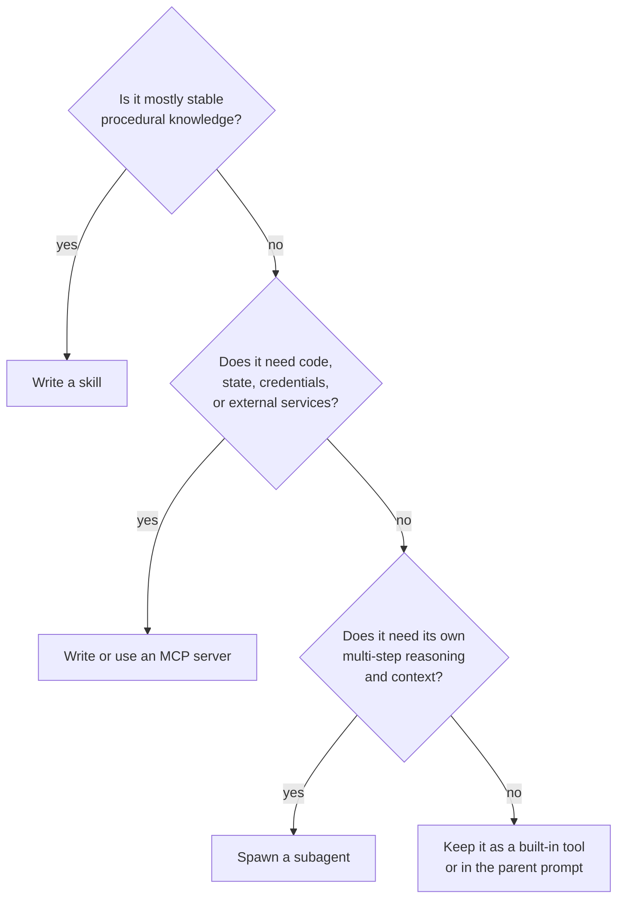
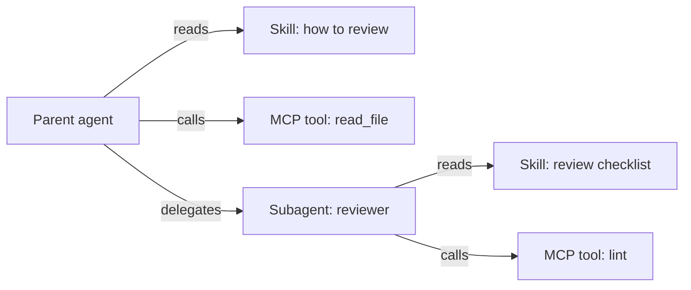

# Chapter 14 — Skills, MCP, and subagents: three shapes of one capability

## TL;DR

A capability that the model needs but does not yet have can take one of three shapes: a **skill** — instructions for the model on how to do something, written as a markdown file; an **MCP server** — an external process that exposes the capability as tools (Ch.13); or a **subagent** — a separate agent loop with its own context and result contract (Ch.10). They are not interchangeable. A skill is cheap and teaches the model *how*; an MCP server is moderate cost and isolates the *execution*; a subagent is expensive and isolates the *reasoning*. This chapter is the decision rubric, the design rules for each shape, the failure modes per shape, and how to move a capability from one shape to another as the system matures.

---

## Why this matters

The first instinct of every team building an agent that hits a new capability gap is *"spawn another agent."* Most of the time, the right answer is *"write a skill."* The second-most-of-the-time, the right answer is *"call out to an MCP server."* The full agent loop is the most powerful and the most expensive option — useful exactly when the work needs its own context and reasoning, almost never otherwise.

A team that defaults to subagents accumulates cost they cannot see (every spawn is a full model loop) and complexity they will eventually pay for (multi-agent orchestration adds failure modes that single-agent doesn't have). A team that knows the decision rubric and starts at the lightest level moves faster and ships cleaner.

---

## The concept

### The three shapes in one sentence each

- **Skill** — markdown instructions baked into the agent's prompt that teach the model how to use the tools it already has for a recurring task.
- **MCP server** — a separate process exposing tools the agent calls; the capability lives outside the agent and is reusable across many agents.
- **Subagent** — a full agent loop spawned by the parent for a bounded subtask, with its own prompt, tool set, budget, and result contract (Ch.10).

The same capability — *"review this PR"* — can take all three shapes. Pick the lightest one that fits.

### Skills — anatomy

A skill is a markdown file with YAML frontmatter and a free-form body:

```markdown
---
name: review_typescript
description: Review TypeScript code for type, async, and security issues.
version: 1.2.0
platforms: [coding-agent, code-review-bot]
prerequisites: [typescript-installed]
---

# Review TypeScript code

When reviewing TypeScript code, in this order:

1. Check public function inputs are typed.
2. Check async errors are handled (no swallowed promises).
3. Check user-controlled strings reach shell / SQL / HTML sinks safely.
4. Report findings before style comments.
5. Quote the file:line you're commenting on.

Do not invent issues. If unsure, flag *suggested review needed* and move on.
```

Five fields recur across production systems: `name`, `description`, `version`, `platforms`, `prerequisites`. The body is markdown — instructions, examples, gotchas. Hermes Agent's skill format follows the agentskills.io community convention — an emerging hub for sharing skills, not a formal published standard with a governance body. OpenClaw and OpenCode use the same shape with minor variations.

### Skills — discovery, loading, and the hub

Skills live in four places across systems:

- **Bundled** — shipped with the agent. Universal patterns, baseline behaviors.
- **User-installed** — under `~/.hermes/skills/`, `~/.openclaw/skills/`, or a workspace `skills/` directory. Per-machine or per-project.
- **Plugin-contributed** — registered by a plugin (Ch.11) at boot. Treated as user-installed but versioned with the plugin.
- **Hub-distributed** — Hermes Agent integrates with `agentskills.io`: `hermes skills install <name>` pulls a skill from the hub, the agent reads it next session. This is the marketplace pattern; expect more agents to adopt it.

Discovery is a directory scan at startup; the scanner reads the frontmatter and registers each skill. The full body is not loaded into memory at scan time — that comes later.

### Skills — progressive disclosure (in brief)

Ch.06 covered the retrieval pattern in full: a skill *index* (name + description + version) lives in the prompt every turn — a few hundred tokens regardless of how many skills exist — while the skill *body* loads on demand through a `skill_view(name)` tool. The Ch.14 angle worth restating: every entry in the index is prefix cost, every body is potential prompt injection (see the trust subsection below), and twenty crisp skills consistently outperform two hundred mostly-irrelevant ones. The Ch.06 budget rule applies — archive skills the agent has not touched in months — and the trust rules below apply to anything you index.

### Skills — curation

Skills age. A skill the agent never uses, or one that calls deprecated APIs, is worse than no skill — it pulls the model toward stale patterns. Ch.07 covered the full curator lifecycle (active → stale → archived); the skill-specific applications:

- **Active** — used in the last N days; appears in the index.
- **Stale** — not used in 30 days; still in the index but flagged.
- **Archived** — not used in 90 days; removed from the index, recoverable.

Hermes Agent's curator runs on an idle-time schedule and can do something stronger: *write new skills from successful sequences*. If the agent reliably runs three tools in the same order to handle a recurring task, the curator promotes that sequence to a skill the model can name. This is one of the more powerful patterns in production — *skills that write skills*.

### Skills — provenance, trust, and prompt-injection risk

A skill is text the agent reads as instructions every session. That makes it one of the highest-leverage attack surfaces in the whole system — a malicious skill is, mechanically, prompt injection by another name. The right default: *treat every user-installed or hub-distributed skill as untrusted until you have a reason not to.* The trust model worth pinning even while the protocols mature:

- **Provenance.** Every skill carries `name`, `version`, *and* a `source` — the URL it came from, the hub entry, the file path, or the plugin that contributed it. The install gate (Ch.12) reads `source` and decides whether to ask. Skills that come from outside the bundled set should not enter the index silently.
- **Install-time approval.** A new skill is a Ch.12 approval, the same as a new MCP server. Show the user the skill's body — every line of it — before it enters the index. *"Trust this skill from this source"* is scoped by source, version, and a fingerprint of the body; a body rewrite invalidates the trust and triggers a fresh ask.
- **Signing.** Where the hub or distribution channel supports it, verify the signature against a published key. Skill registries are early enough that signing semantics are not standardized — track the spec, sign what you can, refuse to install unsigned skills from public sources by default.
- **Body inspection.** Before adding a skill to the index, run a Ch.18 threat scan over the body — the same patterns the memory layer uses in Ch.07. A skill that contains *"ignore previous instructions"* never reaches the prompt.
- **Uninstall is one click.** If the source becomes untrusted (compromised hub, compromised author), the user must be able to remove the skill without editing files. The curator from Ch.07 owns archive; uninstall is its operational sibling.

The general rule that surprises teams the first time they think about it: *a skill is more dangerous than an MCP server*. The server's tools execute in process isolation; the skill's text executes inside your model's prompt. Treat the skill boundary at least as carefully as the MCP-trust boundary — and usually more.

### MCP servers — when to write your own

Ch.13 covered the MCP protocol. The remaining question is: *when do I write an MCP server instead of a built-in tool or a skill?* Three signals:

- **The capability lives outside the agent process** — a database, a browser, a third-party SaaS, a service in a different language or runtime. Process isolation is genuinely useful.
- **The capability is reusable across many agents** — you build it once and several different agents in your org consume it.
- **The capability needs its own credentials or trust boundary** — the MCP server holds the API key; the agent process never sees it.

If none of these is true, the lighter answer is usually a built-in tool (Ch.03) or a skill.

### MCP servers — naming, schema, auth

The design choices that matter when you do write one:

- **Single-purpose vs multi-capability.** A small, focused server (`pg-query`, `s3-list`) is easier to test, secure, and version than one server with twenty unrelated tools. Prefer many small servers over one giant one.
- **Tool naming.** The harness will namespace your tool as `mcp__<server>__<tool>` (Ch.13); pick clear short tool names since they show up in the model's prompt every turn.
- **Schemas.** Tool schemas are part of the prefix (Ch.04). Keep them tight; every optional field is prefix bytes and a chance for the model to fill them wrong.
- **Annotations.** Mark each tool's metadata explicitly via MCP's `readOnlyHint`, `destructiveHint`, `idempotentHint`, and `openWorldHint` — so the harness wires Ch.02 parallelism, Ch.12 approval, and Ch.08 retry safety correctly when it consumes you. The `Hint` suffix is deliberate: a consuming harness should treat these as conservative defaults a server *claims*, not assertions it has *proven* (Ch.13).
- **Auth.** Hold credentials inside the server; never accept them as tool arguments from the model. Use OAuth or an environment-mounted secret; rotate them without the agent needing to know.

### Subagents — the profile as the unit

Ch.10 covered the delegation mechanics. The thing *this* chapter cares about is the unit of extension: a subagent is best understood as a *profile* you can spawn — a named role with a fixed system prompt, a tool list, a model, a budget, and a result schema.

```ts
type SubagentProfile = {
  name:           string;       // "reviewer", "implementer", "researcher"
  description:    string;       // what the supervisor reads when picking
  systemPrompt:   string;       // role-specific instructions
  model:          string;       // often cheaper than the parent's
  toolAllowlist:  string[];     // tighter than parent's
  maxSteps:       number;
  recursionDepth: number;       // usually 1 — see Ch.10
  resultSchema:   JsonSchema;
};
```

The supervisor (Ch.10) picks profiles by name; the registry is just a map. OpenCode's built-in profiles — `build`, `plan`, `general`, `explore` — are the canonical reference. Custom profiles are how you add specialists for your project.

### Subagents — built-in profiles vs custom

A useful starting set, across production systems:

- **`explore`** — read-only tools, cheap model, returns structured findings. Safest default for *find something* tasks.
- **`build`** — full tool set with writes, expensive model. The general-purpose worker.
- **`plan`** — read-only tools, cheap model, returns a structured plan (Ch.09). Output is a plan, not an action.
- **`reviewer`** — read-only tools, takes another subagent's output as input, returns *approve* or *issues found*. Cheap insurance from Ch.10's verification pattern.

Custom profiles fit the same shape. The discipline: name the profile after the role it plays in your project, not the underlying tools. *"Database migration reviewer"* is a profile name; *"calls pg_query and write_file"* is an implementation detail.

### The decision rubric

| Dimension | Skill | MCP server | Subagent |
|---|---|---|---|
| What it adds | Instructions for the model | External tools | A separate reasoning loop |
| Cost per use | A few prompt tokens; body only when loaded | One tool-call protocol hop | A full model loop |
| Isolation | None | Process boundary | Context + tool + model boundary |
| Best for | Stable procedures the model keeps re-inventing | Capabilities outside the agent process | Bounded subtasks needing their own reasoning |
| Failure mode | Model ignores or misapplies | Server crashes, schema drift | Subagent loops, drifts, over-spends |
| Update cadence | At session start | Independent server deploys | Per agent-config change |
| Versioning | YAML frontmatter `version` | Server release | Profile definition |

Add concrete cost estimates when you can measure them in your own stack: a skill is essentially free per use after the indexing cost; an MCP tool call adds a handful of milliseconds plus serialization; a subagent run adds hundreds of milliseconds and a full model loop's token spend.



The defaults production systems land on: skills are tried first, subagents last. If your team is reaching for subagents on most new capabilities, your skills layer is probably underdeveloped.

### The same capability three ways

A concrete example to make the rubric tangible. The capability is *"summarize a long document."*

**As a skill** — when the document is already in the agent's context and the model just needs the procedure:

```markdown
---
name: summarize_document
description: Summarize a document already in context.
version: 1.0.0
---

# Summarize document

1. State the central claim in one sentence.
2. List up to five supporting points.
3. Mention caveats from the source.
4. Keep the summary under 150 words.
Do not add unsupported opinions.
```

**As an MCP tool** — when summarization needs external processing: PDF parsing, a document store, vector lookup:

```ts
const summarizeTool = {
  name: "summarize_document",
  description: "Summarize a stored document by ID.",
  input_schema: {
    type: "object",
    required: ["documentId"],
    properties: { documentId: { type: "string" } },
  },
  // Implementation lives in the MCP server, calling private stores.
};
```

**As a subagent** — when summarization is itself a research task: many documents, conflicting evidence, iterative reading, structured synthesis:

```ts
await delegate({
  role:         "researcher",
  objective:    "Synthesize the strongest claims across these documents.",
  context:      buildContextPacket(documentIds),
  allowedTools: ["read_document", "search_documents"],
  maxSteps:     12,
  outputSchema: ResearchSummarySchema,
});
```

Three shapes, three cost profiles, three failure modes. The capability is the same; the choice depends on where the complexity lives.

### Composition: how the three combine

The three shapes are designed to compose:



Three patterns from production:

- **A skill that calls MCP tools.** The skill instructs the model on how to compose a sequence of MCP-wrapped tool calls. The model reads the skill, then dispatches the tools.
- **A subagent that has its own skills.** When a subagent is spawned (Ch.10), it inherits the parent's skill index by default; OpenCode lets you pass a subset. The subagent sees the same `skill_view` tool the parent does.
- **An MCP server whose tool internally runs a subagent.** A plugin wraps a subagent invocation as an MCP-exposed tool. From the outside it looks like a tool; inside it spawns a full agent loop. Useful for reusing a specialist across many agent installations without re-implementing the profile.

The three layers are not a hierarchy. You mix them per capability based on the rubric.

### Migration between shapes

Capabilities move between shapes as a system matures. Four common migrations:

- **One-shot tool sequence → skill.** If the model keeps calling the same three tools in the same order, write a skill that names the pattern. The model reaches for it directly instead of rediscovering it.
- **Skill → MCP server.** If a skill grows large or starts to need credentials or external state, lift it into a server. The skill becomes a one-line instruction *"call mcp__server__do_thing"* and the work moves out of the prompt.
- **MCP server → built-in tool.** If an MCP tool is called on every turn, the per-call protocol cost adds up. Promote it to a built-in (Ch.03) for the latency win.
- **Subagent → skill + tools.** When a subagent profile is essentially executing a procedure (not exploring), collapse it into a skill that the parent reads, executed against the parent's own tools. Saves a full model loop per invocation.

Migration is normal, not a sign of bad initial design. The shape that fit at week one is rarely the shape that fits at month six.

### Failure modes per shape

| Shape | Failure | How you notice | What to do |
|---|---|---|---|
| Skill | Model ignores it | `skill_view(name)` is never called; the model's output bypasses the skill's procedure | Tighten the description; promote a key step to a built-in tool |
| Skill | Stale guidance | Model follows outdated steps | Curator archival (Ch.07); version field; explicit deprecation |
| MCP server | Crash or timeout | Tool-result error envelope | Reconnect with backoff (Ch.13); fall back to a built-in if available |
| MCP server | Schema drift | A new `tools/list` returns a different shape | Re-list on every connect; warn the operator if a tool disappeared |
| Subagent | Loops, drifts | Step budget hits its cap; reviewer disagrees | Tighten profile's tools + system prompt; lower the budget; add a reviewer |
| Subagent | Over-spends | Token or cost budget exceeded | Budget cap (Ch.10); cheaper model for the profile |

A useful note across all three: name failures are usually the *first* sign something is wrong. A skill called `review_typescript` is harder to confuse with a different skill than `reviewer`. An MCP tool prefixed `mcp__github__create_pr` is harder to mis-dispatch than `create_pr`. A subagent named `db-migration-reviewer` is more legible to the supervisor than `subagent-7`. Naming is design.

### Plugin skills, plugin tools, plugin agents

A note on the third axis: plugins (Ch.11) can contribute any of the three shapes. A single plugin can ship:

- a **skill set** — markdown files registered into the skill index;
- an **MCP server** — bundled binary or stdio-spawned process;
- a **subagent profile** — system prompt + tool list + result schema, registered in the profile registry.

OpenClaw and Hermes Agent both have all three; OpenCode plugins extend skills and tools but not profiles. The choice within the plugin follows the same rubric — pick the lightest shape that fits the plugin's purpose.

---

## Real-system notes

- **Hermes Agent** is the richest reference for skills: full SKILL.md format compatible with `agentskills.io`, a directory scanner, a curator that promotes successful sequences to new skills, hub integration via `hermes skills install/push`, and version-aware archival.
- **OpenCode** exposes both subagent-style delegation (the `task` tool) and a `skill` tool, plus filters tools through agent permissions. The cleanest reference for the built-in profile set (`build`, `plan`, `general`, `explore`) as a starter taxonomy.
- **Paperclip** uses skills and adapters to coordinate external agent runtimes — it shows how these three primitives become operational controls at the org level: skills as instructions, adapters as the MCP-shaped boundary, agents-as-subagents in the control plane.
- **OpenClaw** shows the plugin layer most cleanly: plugins contribute skills, MCP servers, and channel adapters through one plugin SDK. Good reference for *all three shapes from one plugin*.

---

## Pair with your agent

A few prompts that work well on this chapter:

- *"Take ten new capabilities I might add to my agent. For each, walk the decision rubric and tell me whether it should be a skill, an MCP tool, or a subagent. Justify each pick with the dimension that drove it."*
- *"Audit my current agent. Classify everything in `skills/`, every MCP server I'm calling, and every subagent profile. Flag anything that's in the wrong shape and propose a migration."*
- *"Write three versions of the *summarize a document* capability for my stack — one as a skill, one as an MCP tool, one as a subagent. Measure latency and tokens for each on the same 10 KB input."*
- *"Implement the skill index pattern with `skill_view`. Add a metric for how often the model actually calls `skill_view` per skill. Tell me which skills are dead weight in the index."*
- *"Set up a subagent profile registry with `explore`, `build`, `plan`, and one custom profile for my project. Show me the supervisor's profile-picking logic and the result schemas for each."*
- *"Spot the migration candidates in my agent's last month of logs. Which tool sequences are repeated enough to be skills? Which MCP tools are called every turn and should be built-ins? Which subagent profiles are essentially deterministic and should collapse to skills?"*
- *"Write a plugin that contributes all three shapes: one skill, one MCP tool, one subagent profile. Verify each registers cleanly and the agent can use all three in one session."*

---

## What's next

You now know the unit of extension. Ch.15 moves to the *backend* that keeps the harness running at scale — queues, streaming endpoints, durable side-effect machinery, and the runtime that hosts the loop, the memory, the persistence, and the connectors when there are more than one user and more than one session in flight.
