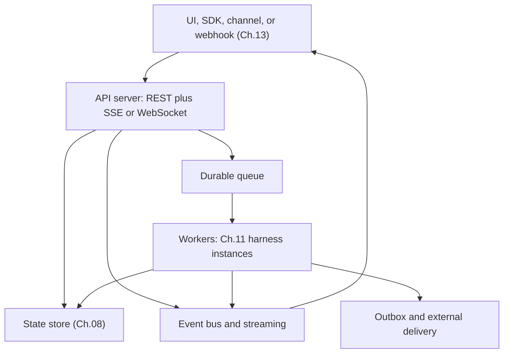
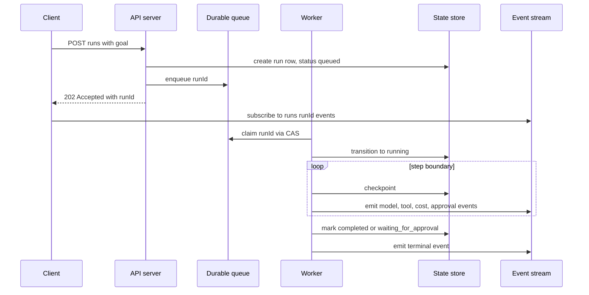
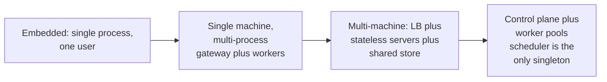

# Chapter 15 — Backend infrastructure for agents

## TL;DR

A web request lives for milliseconds. An agent run can live for minutes, hours, or many wake-ups. Production backends therefore separate request acceptance from execution: accept work, enqueue it, stream progress, checkpoint state, and make side effects idempotent. This chapter covers the scaling angle — how the harness from Ch.11 becomes a service for many users: the API surface (REST + SSE + WebSocket), the queue and worker shapes, the heartbeat-style scheduler that wakes due work, deployment topology from embedded to multi-machine, multi-tenant isolation, secrets, backups, rate limits, budgets, the operational surface, and the single-user assumptions that quietly break the first time you run on more than one box.

---

## Why this matters

The simplest agent backend is an HTTP endpoint that calls a model synchronously and returns the final answer. That works for a one-turn demo. It breaks the moment the agent needs tools, approvals, retries, long context, or background work. Three failures show up quickly:

- **Client timeout.** The request times out while the worker is still running.
- **Duplicate execution.** The client retries; now two copies may perform side effects.
- **No visibility.** The user sees a spinner instead of progress, tool calls, approvals, and errors.

The fix is not a longer timeout. The fix is a different architecture — one designed for work that outlives any single request.

---

## The concept

### The shape of a backend

A production agent backend usually has five layers:



Each layer is something you have already seen. The harness from Ch.11 is what runs inside each worker. The state store is Ch.08. The bus and streaming surface are Ch.11 plumbing. The channel adapters and webhooks are Ch.13. This chapter is about how those existing pieces fit together when *one user* becomes *many users* and *one process* becomes *many machines*.

### The API surface

The API exposes three shapes of operation:

- **Mutations** — `POST /runs`, `POST /messages`, `POST /sessions`. Short HTTP requests that change state and return quickly. They never call the model in the request path.
- **Live streams** — `GET /runs/:id/events` (SSE) or `WS /runs/:id` (WebSocket). Long-lived connections that deliver progress events to the client. SSE for one-way; WebSocket when the client also sends — interrupts, mid-run approvals, plan edits (Ch.09).
- **Polling reads** — `GET /runs/:id`, `GET /runs/:id/transcript`. For clients that cannot hold a long connection.

OpenCode exposes exactly this shape: REST mutations, SSE for live events, a typed SDK that wraps the HTTP API for callers who want it as a library. Paperclip layers a control-plane API on top — issue creation, agent listing, approval routing — so operators have their own surface separate from the agent's. Hermes Agent goes one step further with an OpenAI-compatible endpoint so existing OpenAI clients can drive it without changes.

### Enqueue, stream, finish

The canonical request flow for a long-running agent run:



The principles, all introduced earlier:

- The API handler **never calls the model.** It writes durable state and enqueues. Returns 202 in under 100 ms.
- The worker claims with CAS (Ch.08) so two workers never run the same job.
- Every step boundary writes a checkpoint (Ch.08) and emits an event to the bus.
- Streaming to the client is decoupled from the worker via the bus, so the worker's progress is visible even if the client disconnects and reconnects.

### Queue and worker patterns

| Backend | Best for | Main limitation |
|---|---|---|
| In-memory queue | Local demos, single process | Lost on restart — do not pretend this is durable |
| SQLite atomic UPDATE | Single machine, single-tenant | Single writer; does not scale across machines |
| Postgres `SELECT ... FOR UPDATE` | Multi-machine, moderate scale | Watch lock contention and queue-claim strategy as worker count grows; the threshold depends on schema and workload |
| Redis Streams or NATS JetStream | Higher throughput, you operate the broker | Operational overhead — broker is a service to run |
| SQS or Pub/Sub | Managed durable handoff, cloud-native | Cloud lock-in; vendor-specific semantics |
| Temporal, Restate, DBOS | Distributed long-running workflows with retry baked in | More concepts; platform commitment |

Start simple. Most production agents ship on SQLite or Postgres long before they need Kafka. The pattern is the same regardless of the backend: every job is a durable row with a status column, the worker claims atomically (Ch.08's CAS pattern), the worker writes events and checkpoints, the worker transitions to a terminal state.

```ts
// Worker loop. The control flow is the same regardless of queue backend.
async function workerLoop(ctx: WorkerContext) {
  for await (const job of ctx.queue.claimRuns()) {       // CAS-based claim
    try {
      await ctx.db.runs.update(job.runId, { status: "running" });
      await executeAgentRun(job.runId, ctx);              // the Ch.11 harness
      await ctx.db.runs.update(job.runId, { status: "completed" });
      await job.ack();
    } catch (err) {
      await ctx.db.runs.update(job.runId, { status: "failed" });
      await ctx.db.runEvents.insert({
        runId: job.runId,
        type:  "run.failed",
        payload: { message: String(err) },
      });
      await job.releaseOrDeadLetter(err);                 // bounded retries
    }
  }
}
```

Tune the worker pool to the model provider's rate limit, not the box's CPU. Most agent backends are I/O-bound on the model API; running ten workers on one CPU is fine if the model can keep up.

### The heartbeat scheduler

Some work has no inbound request — cron jobs, scheduled reviews, retries with backoff, recurring agent tasks. The pattern across systems is a *heartbeat*: a single scheduler process wakes up on an interval, queries the state store for due work, and enqueues it.

```ts
// Single scheduler tick, every N seconds.
async function heartbeat(ctx: SchedulerContext) {
  const due = await ctx.db.query(`
    SELECT id FROM runs
     WHERE status = 'scheduled'
       AND wake_at <= now()
     LIMIT 100
  `);
  for (const row of due) await ctx.queue.enqueue(row.id);

  await ctx.reaper.reapOrphanedRuns();      // Ch.08
  await ctx.curator.maybeRunCurator();      // Ch.07
}
```

Paperclip's heartbeat is this shape — it queries for due `heartbeat_runs`, runs the orphan reaper, and triggers the background curator on idle. The scheduler is one of the few components that must be *singleton* at scale: with two schedulers running, you get double dispatch unless you add a distributed lock. Most teams elect a scheduler leader via the same CAS row pattern from Ch.08 (a `service_locks` table, claimed and refreshed every few seconds).

### Deployment topology spectrum



Pick the leftmost shape that fits your traffic, not the rightmost shape your peers are using. The migration story:

- **Embedded** — Hermes CLI, OpenCode local. Everything in one process; SQLite on disk. Fits one user perfectly.
- **Single-machine multi-process** — Hermes gateway, OpenClaw. One parent (gateway + scheduler), child processes per agent. SQLite with WAL handles concurrent reads. Scales until one CPU is the bottleneck.
- **Multi-machine** — Paperclip in standard config. Multiple stateless servers behind a load balancer; shared Postgres; a single elected scheduler. Add machines for throughput.
- **Control plane + worker pools** — Paperclip's full shape at scale. The control plane (API + scheduler) is separate from the worker pools (potentially in different regions or owned by different teams). Workers register with the control plane, claim work, report status.

Two anti-patterns. *Premature distribution*: starting at multi-machine when you have one tenant — operational complexity without scaling benefit. *Stuck at embedded*: keeping in-memory state when you already have fifty concurrent users — quiet correctness bugs as state drifts between request and worker.

### Embedded vs external database

Production storage choice tracks the deployment shape:

- **SQLite + WAL** (OpenCode, Hermes CLI) — embedded; data lives next to the process; backups are file copies. Fits embedded and single-machine. Hermes Agent's `apply_wal_with_fallback` handles the NFS/SMB case (WAL is incompatible) by falling back to journal mode.
- **Embedded Postgres** (Paperclip's zero-config option) — bundled; no external service to install; Postgres-shaped queries without an ops team. Useful between SQLite and full Postgres.
- **External Postgres** (Paperclip in production) — required once you have more than one server. The schema is in one place; multiple servers connect; migrations run on startup; backups via scheduled `pg_dump`.

Both SQLite and Postgres carry real production weight. The right time to move from SQLite to Postgres is *not* a user-count threshold — it is the moment a second writer needs to coordinate. Until then, SQLite + WAL is faster, simpler, and easier to back up.

### Multi-tenant isolation

Three isolation tiers, each with a clear cost:

| Tier | What is isolated | Cost | When |
|---|---|---|---|
| **Row scoping** | Rows tagged with `tenant_id` | Cheapest | Most B2C and small-team B2B |
| **Per-tenant database** | One DB per tenant | Operational | Strict regulatory requirements |
| **Per-tenant compute** | One pod or container per tenant | Highest | Sensitive data or compliance mandates |

Paperclip uses row scoping at the `company_id` level — every table has `company_id`, every query filters on it. The risk: one missing `WHERE` clause leaks cross-tenant. Mitigations:

- **Default-deny at the storage layer.** Queries without a tenant context should error, not return everything.
- **Synthetic tenant tests in production.** A continuous test that creates fake data in tenant A and queries from tenant B (expecting zero results) catches leaks long before a user does.
- **Audit log is also tenant-scoped.** Ch.05's append-only log gets its own `tenant_id` column; operator views default to scoped, not global.

Row scoping is the default; per-tenant DB and per-tenant compute are step-up tiers when regulations or trust requirements force them.

### Secrets management

Secrets live in three places across production agent backends:

- **Env vars or local files** (OpenCode, Hermes CLI) — fine for single-user, single-machine. Not multi-tenant.
- **OS keychain** (OpenCode for credentials) — system-level, encrypted at rest, accessed via OS API.
- **Vault or secret manager** (Paperclip with `local_encrypted` or `aws_secrets_manager`) — required at multi-tenant scale. Each tenant's secrets are isolated; resolved at runtime; never written to logs.

The discipline that holds across all three: secrets are *referenced* in config (e.g., `$secret:slack_token`), *resolved* at runtime, and *never logged*. The config file on disk should never contain a resolved secret — the serializer always re-emits the reference. Ch.07's redaction layer handles the log path; the secrets layer handles the storage path.

Rotation is usually manual. Hermes Agent's `credential_pool` rotates among multiple API keys on rate-limit errors but does not generate new ones; that is operator work.

### Backups, restore, disaster recovery

State that is not backed up will eventually be lost. Three practices:

- **Scheduled snapshots.** Paperclip ships periodic `pg_dump` with 7-day retention by default. SQLite-backed systems should run `VACUUM INTO` on a schedule and copy the file out. Daily is the minimum; hourly if cost allows.
- **Restore rehearsal.** The first time you restore from a backup should not be during an incident. Schedule a quarterly drill: stop a staging instance, restore yesterday's snapshot, validate the state machine is consistent (Ch.08).
- **Schema migrations are forward-only.** Ch.08 covered the rule; at scale it is enforced — production never rolls back a schema. Additive migrations (new columns with defaults) are safe; destructive ones wait until two releases past their last consumer.

### Data governance at the backend

Multi-tenant rows and encrypted secrets are part of the security story, not the whole one. Five concerns show up the moment a backend handles real users with real data:

- **API authentication and authorization.** Every API call needs identity (a session token, an API key, an OAuth bearer) *and* an authorization check (does this principal have rights on this tenant, this run, this resource?). Default-deny on missing identity. Authorization decisions live in middleware that runs before any handler, not scattered inside route bodies — that is what keeps a missing check from becoming a cross-tenant leak.
- **Encryption.** In transit (TLS at the edge *and* between internal services, not just at the load balancer) and at rest (database-level encryption for the state store; field-level encryption for high-sensitivity columns like message bodies or memory entries). Disk-level encryption is the floor, not the ceiling.
- **Data residency.** Some users are bound by regulations that say data must stay in a specific region (EU GDPR is the canonical case; many sectoral regulators are similar). The state store, the model provider, and the object store all have to live in the right region. Resolve this at deployment topology, not at runtime — a request that has to cross a regional boundary to find its session is already non-compliant.
- **Model-vendor data controls.** Some model APIs train on your inputs by default; some let you opt out; some forbid you from sending certain data classes at all. Read the vendor's data-use policy before you wire it in; pick the endpoint (training-allowed vs zero-retention) that fits the data class, and record the choice in the audit log alongside the run.
- **Retention and deletion at the storage layer.** Ch.07 owns the *writing-side* mechanics (deletion markers, supersedes chains); Ch.18 owns the *policy* (consent, right-to-be-forgotten, audit retention). Ch.15's job is to honor both at storage: a `tenant_id` deletion that actually cascades, a backup-retention policy that does not resurrect deleted data on restore (Ch.08's replay-privacy rule), and region-scoped backups so residency holds through disaster recovery.

These five are the backend's contract with the regulator, the security team, and the user. Ch.18 covers the threat model end-to-end; this chapter is where the storage and routing decisions that *implement* the contract get made.

### Horizontal vs vertical scaling

The bottleneck migrates as you grow. A typical path:

- **1 server.** CPU-bound on the loop and tool execution. Fix: more CPU on that box.
- **10 servers (rough order of magnitude).** Postgres contention can start to bite — `SELECT ... FOR UPDATE` lock waits, connection-pool saturation. The exact threshold depends on schema, index strategy, lock granularity, and the read/write mix; some workloads feel it earlier, others scale to hundreds before it does. Fix: connection pooling (PgBouncer), partition the queue (shard by tenant or queue name), or move to `SELECT ... FOR UPDATE SKIP LOCKED` so workers do not serialize on each other.
- **100 servers.** Postgres is no longer enough as the queue. Fix: dedicated distributed queue (Kafka, Redis Streams, NATS JetStream).
- **1000+ servers.** The scheduler heartbeat becomes its own scale problem. Fix: shard the scheduler by tenant or region.

The honest framing: most agent backends never reach 10 servers. Optimizing for 1000 before you have 10 is engineering as recreation.

### Load balancing and sticky sessions

Three balancing strategies:

- **Round-robin.** Each request goes to a different server. Stateless, simple. The cost: any in-memory cache (system prompt, working set) misses on the second request. Pair with database-backed caches if you go this way.
- **Sticky sessions.** Hash the session ID to a server; subsequent requests for the same session land there. Keeps caches warm. The cost: when a server dies, all of its stickily-bound sessions take a cache miss until the load balancer re-routes them.
- **Hash by tenant.** All of tenant A's traffic to server X, tenant B's to server Y. Predictable; failure is bounded to the affected tenant. Good fit when tenants are heterogeneous in load.

The Ch.04 cache rule shapes this choice. If your prompt cache is provider-side (Anthropic prefix cache), any server that rebuilds the same prompt bytes hits the cache — round-robin works. If your cache is in-process, you want stickiness.

### Rate limiting and admission control

Two layers:

- **Per-tenant rate limit** at the API boundary. Token-bucket per tenant, refilled at a rate matching their subscription tier. Reject (429) when the bucket is empty rather than queueing forever. Keep the bucket per-tenant, not global — a noisy tenant should not block a quiet one.
- **Provider rate-limit cascade** at the model-call site. When the provider returns 429, rotate keys, fall back to a different provider, or fall back to a smaller model (Ch.17 owns the routing detail). Hermes Agent and Paperclip both implement credential pools that rotate on 429.

A useful production touch: surface the rate limit as a *first-class run state*, not a silent retry. The user should see *"waiting for rate limit"* in the streaming events, not a blank spinner.

### The cost ledger at the backend

Every agent run consumes tokens, which costs money. At scale, the cost ledger is operational, not optional:

- **Per-run cost** recorded as the run terminates — tokens in, tokens out, by provider and model.
- **Per-tenant rollups** — daily and monthly aggregates so billing or chargeback works.
- **Budget gates.** Before each run, check the tenant's remaining budget; refuse the run if it would exceed. Paperclip's `budgets.getInvocationBlock()` is the canonical pattern.
- **Operator override.** An admin can grant a one-time credit or raise a cap mid-month; the action is audited.

The ledger is durable (Ch.08) so partial compaction of the message log does not lose cost data. Pair the ledger with the trace pipeline (Ch.16); cost is one of the most useful per-tenant signals to plot.

### Side-effect durability: the outbox at scale

Ch.08 introduced the outbox pattern. At scale, three details matter:

```ts
type OutboxRow = {
  id:              string;
  runId:           string;
  action:          string;        // "post_slack_message", "send_email", ...
  idempotencyKey:  string;
  payload:         unknown;
  status:          "pending" | "dispatching" | "dispatched" | "failed";
  attemptCount:    number;
  nextAttemptAt:   string;
};

async function checkpointWithOutbox(ctx, input) {
  await ctx.db.transaction(async (tx) => {
    await tx.checkpoints.upsert(input.checkpoint);
    await tx.outbox.insert({ ...input.row, status: "pending" });
  });
}

async function dispatchOutbox(ctx) {
  const rows = await ctx.db.outbox.claimPending({ limit: 50 });
  for (const row of rows) {
    try {
      await ctx.externalActions.dispatch(row.action, row.payload, {
        idempotencyKey: row.idempotencyKey,
      });
      await ctx.db.outbox.markDispatched(row.id);
    } catch (err) {
      await ctx.db.outbox.scheduleRetry(row.id, backoff(row.attemptCount));
    }
  }
}
```

- **Write the intent before the side effect.** The checkpoint and the outbox row commit in one transaction; if the worker crashes before the side effect, the outbox row is still there for the dispatcher to retry.
- **At-least-once is the realistic semantic; effectively-once is the goal.** True exactly-once delivery across networks is not a distributed-systems promise you can make — the worker can crash between the side effect landing and the marker being written, and no protocol prevents that. What you can build instead is *effectively-once*: the dispatcher may attempt a side effect more than once on recovery, but the downstream (Stripe, GitHub, most modern HTTP APIs, every well-built queue) dedupes by the idempotency key so the *observed* effect is one. For the few downstreams that do not honor idempotency keys, keep a dedup table on your side and look up before dispatch.
- **Outbox is itself a scaling concern.** A backlog in the outbox is a sign your downstream APIs are slower than your agent throughput. Monitor outbox depth; alert when it grows.

### The single-user assumption that breaks at scale

A list of patterns that work fine for one user and silently break for many:

- **Module-level globals** — a singleton `sessionState`, a global tool registry. Once two requests share a process, they share the global. Move state into a `tenantContext` parameter or a per-request scope.
- **Sequential dispatch** of channel events. *"Process Slack messages one at a time"* is fine for one user; with a hundred tenants, you have head-of-line blocking. Process in parallel with per-tenant ordering.
- **File-based session storage** for everything. JSON files on disk are great until 10,000 of them share a directory and the filesystem indexer chokes. Use a database past a couple of thousand sessions.
- **In-process schedulers.** Each server runs its own `setInterval`; you get N × the work. Elect a singleton scheduler (CAS row from Ch.08) or move to a managed scheduler.
- **In-process caches.** Local memory; not shared across servers; lost on restart. Move to Redis, or accept the per-server cost.

Each is a small bug for one user and a class of production incidents at scale. Audit your harness for them before you ship the second server.

### Cold start, warm pool, and serverless

Three latency profiles, each with a use:

- **Cold start.** Process starts when the request arrives — schema migration check, plugin load, first model call. Typically multiple seconds, sometimes longer on big bundles. Acceptable for cron-driven work; painful for interactive chat.
- **Warm pool.** Keep N idle workers running, ready to claim work. Latency drops to roughly a hundred milliseconds. Costs memory continuously. Hermes Agent caches gateway agents this way; Paperclip spawns on demand.
- **Serverless** (Lambda, Cloud Run, similar). Cold starts every time unless you provision concurrency. Each platform has its own hard limit on execution time — well under an hour, varies by vendor; check the current docs before designing around it. Useful for stateless tool servers; usually the wrong shape for the agent loop itself, which needs to outlive a single function invocation.

The right shape per workload: interactive chat wants warm pool; cron and batch want cold-start-acceptable workers; tool servers can be serverless behind MCP (Ch.13).

### Storage tiers and caching

Three tiers of storage that production systems converge on:

- **Hot** (Postgres or SQLite): recent session state, recent transcripts, the run table. Sub-100 ms reads.
- **Warm** (object store like S3): large artifacts, file uploads, oversized tool outputs (Ch.05's clip-and-stash pattern). Hundreds of milliseconds; cheap per GB.
- **Cold** (Glacier or tape): old runs past retention, audit archives. Hours to restore; for compliance only.

Plus a caching layer (Redis, in-process) for things that recompute on every request: rate-limit buckets, session metadata, the prompt fingerprint from Ch.04. The cache is *not* durable; treat misses as normal, not exceptional.

### The operational surface

Past the first hundred concurrent users, you need an operator-facing UI. Production agent backends converge on five views:

- **Run inspector** — a specific run's input, full event stream, tools called, cost, final state. Essential for *"why did the agent do this?"* questions.
- **Session viewer** — the history of a conversation across runs: retries, approvals, comments, who did what.
- **Approval queue** — pending approvals across tenants (operator view) or for a specific user (Ch.12).
- **Manual retry or cancel** — a button on a failed or stuck run; the action is logged to audit.
- **Budget and credit view** — per-tenant cost and remaining budget, with the operator override button.

Paperclip ships all five in its web UI. The pattern: operator views are read-only by default; every action that mutates state writes to the audit log so post-incident review can answer *who clicked retry on this run?*. The log discipline from Ch.05 and the durability from Ch.08 are what make this trustworthy.

---

## Real-system notes

- **OpenCode** is the cleanest reference for the SDK + embedded-server shape: a local server with REST + SSE, a TypeScript SDK that wraps it, SQLite + WAL for storage, and per-project `InstanceState`. Read it for *what does a clean single-machine backend look like.*
- **Hermes Agent** is the reference for the gateway + scheduler shape: gateway accepts inbound from multiple channels (Ch.13), an in-process scheduler tick handles cron and background review, agents are cached in an LRU with 1-hour TTL, SessionDB persists everything for replay.
- **Paperclip** is the reference for the multi-tenant control-plane shape: Postgres with row-level company scoping, heartbeat scheduler with reaper (Ch.08), `cost_events` and `budget_policies` tables, structured run inspector UI, scheduled `pg_dump` backups, multi-adapter spawning as child processes, `local_encrypted` and `aws_secrets_manager` secrets providers.
- **OpenClaw** ships the channel-heavy gateway version of these patterns — useful study for how the gateway/harness boundary scales when most of the volume is inbound channel events.

---

## Pair with your agent

- *"Draw the layer diagram for my current backend. Identify which Ch.01–14 chapter each layer maps to, and flag anything that's missing or doubled-up (e.g., a queue that's also the state store, a worker that's also the scheduler)."*
- *"Replace any in-memory queue in my code with a durable one (SQLite atomic UPDATE or Postgres `SELECT ... FOR UPDATE`). Add CAS claim and Ch.08's reaper. Stress test with three deliberate worker crashes."*
- *"Set up a single elected scheduler via the CAS pattern from Ch.08. Run two instances of my server; verify only one is dispatching cron and heartbeat work at any time. Kill the leader; verify the other one takes over within 30 seconds."*
- *"Audit my code for module-level globals, in-process caches, file-based sessions, and in-process schedulers. For each, propose the multi-server replacement (per-request context, Redis, DB, elected scheduler)."*
- *"Add per-tenant rate limiting at my API boundary as a token bucket per tenant. Surface *waiting for rate limit* as a first-class run state in the SSE stream."*
- *"Wire the outbox pattern for one specific destructive side effect (sending a Slack message). Crash the worker between transaction-commit and outbox-dispatch; verify the message is delivered *effectively once* on recovery — the dispatcher may attempt it twice, but the downstream API's idempotency key must ensure the user sees only one message. If your downstream does not honor idempotency keys, add a dedup table on your side and verify the same property."*
- *"Set up scheduled `VACUUM INTO` snapshots of my SQLite database every hour with 7-day retention. Schedule a quarterly restore rehearsal and walk through it once now."*
- *"Add the operational surface: run inspector (events, tools, cost, final state), manual retry button, per-tenant cost view with operator override. Audit every operator action in Ch.05's append-only log."*
- *"Move from row-level multi-tenancy to per-database multi-tenancy for one specific high-compliance tenant. Show me what changes in connection pooling, migrations, and backups."*

---

## What's next

You now have a backend that survives many users, many machines, and the day a deploy interrupts ten in-flight agent sessions. The next chapter adds the *visibility* — Ch.16 covers observability: traces, metrics, the audit log as signal, and what to log so post-incident review can answer the questions you will eventually need to answer.
