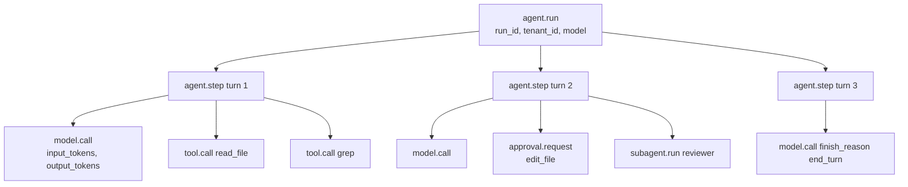
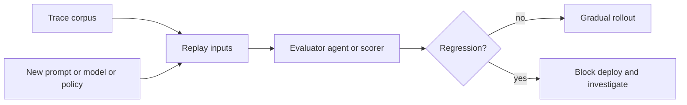

# Chapter 16 — Observability

## TL;DR

Agents are hard to debug from logs alone. You need a trace tree that shows which model call led to which tool call, which tool result changed the next prompt, how many tokens were used, where latency appeared, and why the run stopped. This chapter covers the four pillars of agent observability (traces, metrics, logs, eval), the OpenTelemetry attribute conventions for LLM operations, the correlation-ID chain that ties everything together, the metrics catalog that consolidates every observability signal each prior chapter planted, sampling and redaction rules, and the critical-vs-optional split — what every agent must instrument from day one and what waits until scale forces it.

---

## Why this matters

Without traces, *"the agent got confused"* is not actionable. With traces, you can open one run and inspect: prompt assembly, retrieved memory, tool arguments, tool output size, stop reason, retry count, approval decision, cost. Observability does not make agents reliable. It makes failures visible enough to fix.

The other reason it matters: every previous chapter (Ch.04 through Ch.15) planted a specific metric that depends on this layer. Cache hit rate (Ch.04). Compaction method histogram (Ch.05). Retrieval reach rate (Ch.06). Curator action histogram (Ch.07). Run-state transition counts (Ch.08). Replan rate (Ch.09). Subagent success rate (Ch.10). Approval funnel (Ch.12). Cost ledger (Ch.15). This chapter is where those scattered signals get a shared shape — collected, correlated, and queryable.

---

## The concept

### Four pillars, not three

The classic observability framing is three pillars: traces, metrics, logs. For agents, *eval* is a fourth pillar of equal weight — because the question *"did the agent do the right thing?"* is not answerable from latency and tokens alone.

| Pillar | Question it answers | Volume | Shape |
|---|---|---|---|
| **Traces** | What happened on this specific run? | One per run | Tree of spans |
| **Metrics** | What is happening across all runs? | Continuous | Time series |
| **Logs** | What did the system say at a specific moment? | High | Structured rows |
| **Evals** | Did the agent produce the right outcome? | Sampled | Pass / fail with scores |

Each pillar has a different audience in mature deployments. Traces for engineers debugging incidents; metrics for SRE watching dashboards; logs for forensic review and the audit trail (Ch.05); evals for the team responsible for agent quality.

### The trace tree for an agent run

The natural unit is the run. A run becomes a root span; everything underneath is a child:



The tree is the debugging unit. Logs and metrics point back to a trace ID; the trace is what you open when something went wrong.

### OpenTelemetry attribute conventions

The OpenTelemetry GenAI semantic conventions are the closest thing to a standard for agent telemetry. Many of these fields are still at OpenTelemetry's *Development* stability — the semconv's way of saying *expect renames* — but the shape is stable enough to commit to now and migrate later. The relevant attributes:

| Attribute | What it carries |
|---|---|
| `gen_ai.provider.name` | `anthropic`, `openai`, `bedrock`, etc. |
| `gen_ai.request.model` | The model ID requested |
| `gen_ai.response.model` | The model ID that actually served (may differ on fallback) |
| `gen_ai.usage.input_tokens` | Input tokens billed |
| `gen_ai.usage.output_tokens` | Output tokens billed |
| `gen_ai.usage.cache_read_input_tokens` | Cache hits (Ch.04) |
| `gen_ai.usage.cache_creation_input_tokens` | Cache writes (Ch.04) |
| `gen_ai.response.finish_reasons` | `end_turn`, `tool_use`, `max_tokens`, ... |
| `gen_ai.tool.name` | Tool the model invoked |

Add agent-specific attributes in your own namespace:

```ts
function modelAttributes(call, result) {
  return {
    "gen_ai.provider.name":              call.provider,
    "gen_ai.request.model":              call.modelId,
    "gen_ai.response.model":             result.modelId,
    "gen_ai.usage.input_tokens":         result.usage.inputTokens,
    "gen_ai.usage.output_tokens":        result.usage.outputTokens,
    "gen_ai.usage.cache_read_input_tokens":     result.usage.cacheRead     ?? 0,
    "gen_ai.usage.cache_creation_input_tokens": result.usage.cacheCreation ?? 0,
    "gen_ai.response.finish_reasons":    [result.finishReason],
    "agent.profile":                     call.profile,
    "agent.run_id":                      call.runId,
    "agent.session_id":                  call.sessionId,
    "agent.tenant_id":                   call.tenantId,
    "agent.parent_run_id":               call.parentRunId,        // subagents
  };
}
```

Keep attribute strings in one place. Scattering them across the codebase makes the eventual rename painful, and the rename will come.

### Correlation IDs: the chain that ties everything together

Three IDs must thread through every log line, metric label, and span:

- **`run_id`** — the agent run. One per invocation. Stable across the whole tree.
- **`session_id`** — the conversation thread (Ch.05). One per ongoing session; many runs per session.
- **`step_id`** — one iteration of the loop (Ch.02). Distinguishes turn 3 from turn 7 inside the same run.

Plus the optional ones: `tool_call_id` (matches the Ch.01 round-trip), `subagent_run_id` (when delegating, Ch.10), `parent_run_id` (the inverse).

Without this chain, debugging a production incident requires guessing which log line goes with which run — usually by timestamp, which falls apart the moment two runs overlap. With the chain, a single `grep run_id=abc123` brings back every log, metric, and span for that run.

### Instrumenting the loop, the model call, and the tool call

The three places that earn their span:

```ts
async function invokeAgent(input, ctx) {
  return ctx.tracer.startActiveSpan("agent.run", async (span) => {
    span.setAttributes({
      "agent.run_id":     input.runId,
      "agent.session_id": input.sessionId,
      "agent.tenant_id":  input.actor.tenantId,
    });
    try {
      const result = await runLoop(input, ctx);
      span.setAttribute("agent.status", "completed");
      return result;
    } catch (err) {
      span.setAttribute("agent.status", "failed");
      span.recordException(err);
      throw err;
    } finally {
      span.end();
    }
  });
}

async function callModel(call, ctx) {
  return ctx.tracer.startActiveSpan("model.call", async (span) => {
    const start = performance.now();
    let firstTokenAt;
    const result = await ctx.modelProvider.stream(call, {
      onToken: (token) => {
        if (firstTokenAt === undefined) {
          firstTokenAt = performance.now();
          span.addEvent("model.first_token", {
            ttft_ms: Math.round(firstTokenAt - start),
          });
        }
        ctx.stream.emit(call.runId, { type: "token", token });
      },
    });
    span.setAttributes(modelAttributes(call, result));
    return result;
  });
}

async function executeTool(call, ctx) {
  return ctx.tracer.startActiveSpan("tool.call", async (span) => {
    span.setAttributes({
      "gen_ai.tool.name":   call.name,
      "agent.tool.call_id": call.id,
      "agent.run_id":       call.runId,
    });
    const result = await ctx.tools.dispatch(call.name, call.input, ctx.toolContext);
    span.setAttributes({
      "agent.tool.ok":           result.ok,
      "agent.tool.fatal":        result.ok ? false : result.fatal,
      "agent.tool.result_chars": result.ok ? JSON.stringify(result.result).length : 0,
    });
    return result;
  });
}
```

Time-to-first-token is the most-watched UX metric for streaming agents. Total duration is the most-watched capacity metric. Record both.

### The metrics catalog — composing every prior chapter

Each earlier chapter planted at least one observable signal. Together they form the agent-specific metrics catalog:

| Metric | Source chapter | What it tells you |
|---|---|---|
| `cache_hit_ratio` | Ch.04 | Is the prompt cache earning its keep? Workload-dependent — a reasonable starting target is over half on steady multi-turn workloads, but check Ch.04 for the full picture. |
| `compaction_method_count{method}` | Ch.05 | Which compaction technique is doing the work? |
| `compaction_compression_ratio` | Ch.05 | How much did we save per pass? |
| `retrieval_empty_hand_rate` | Ch.06 | Are queries returning nothing? Bad memory or bad query. |
| `retrieval_reach_rate` | Ch.06 | Does the model actually use what we inject? |
| `memory_write_rejection_rate` | Ch.07 | Is the safety filter biting? |
| `curator_action_count{action}` | Ch.07 | Is the curator pruning anything? |
| `run_state_transition_count{from,to}` | Ch.08 | What states are runs spending time in? |
| `replan_rate` | Ch.09 | How often does the plan need updating? |
| `subagent_success_rate{role}` | Ch.10 | Is each specialist pulling its weight? |
| `health_check_success_rate{probe}` | Ch.11 | Is the harness healthy? |
| `approvals{state}` | Ch.12 | The approval funnel by terminal state. |
| `channel_inbound_count{channel}` | Ch.13 | Volume per channel. |
| `cost_usd{tenant,model}` | Ch.15 | Per-tenant spend by model. |
| `outbox_depth` | Ch.15 | Side-effect delivery lag. |
| `queue_depth{queue}` | Ch.15 | Backlog. |
| `ttft_ms` | this chapter | Time to first token. |
| `tokens_per_run` | this chapter | Cost driver per run. |

This is not a wish list — it is the union of every *"this is also observability"* beat from the earlier chapters. None of them is hard to wire if you instrument the trace tree as above; all of them pay back the first time a metric moves and you ask why.

### Cost as a first-class metric

Cost shows up in the trace (per `model.call` span) and in the metrics (per tenant, per model, per day). The formula is mechanical from Ch.04's attribute set:

```ts
function costFromUsage(usage, model) {
  const r = pricing[model];                  // ask your agent for current rates
  return (usage.inputTokens               * r.input)
       + (usage.cacheReadInputTokens      * r.cache_read)
       + (usage.cacheCreationInputTokens  * r.cache_creation)
       + (usage.outputTokens              * r.output);
}
```

Aggregate to per-tenant-per-day, surface in the operator dashboard (Ch.15), gate against budgets (Ch.17 owns the routing decision). The single most useful alert across production agents is *anomaly detection* on per-tenant daily cost. A reasonable starting rule: page when a tenant's daily cost crosses 3× the rolling 7-day average. Hermes Agent and Paperclip both surface this kind of signal in their dashboards; the threshold is workload-dependent and worth tuning.

### Logs vs metrics vs traces — when to use which

Three roles:

- **Traces** are *causal*. Use them to answer *why did this specific run do that?* They are too verbose for at-a-glance dashboards.
- **Metrics** are *aggregate*. Use them to answer *how are we doing across all runs?* They lose the individual story.
- **Logs** are *granular events*. Use them for forensic review (Ch.05's audit log is the canonical example) and for things that do not fit a span — startup errors, periodic background tasks, the curator's action log from Ch.07.

The rule that holds across all three: every log line, metric data point, and span carries the same correlation IDs, so you can pivot from one pillar to another. Click a metric spike, get the trace IDs that contributed; open one trace, see the logs in its time window.

### Sampling strategy for agent traces

At scale, recording every span gets expensive. A pragmatic sampling policy:

- **Always-on (100%)** — any run that errored, any run that exceeded its budget, any run with an approval, any run that touched a destructive tool, any subagent spawn.
- **Tail-based (100%)** — if any span in the tree errors, capture the full tree retroactively. Requires a buffering collector (OpenTelemetry Collector with `tail_sampling_processor`).
- **Head-based (10–25%)** — everything else, sampled at session start with a deterministic hash of `run_id` so a session's runs are all sampled or all not.

The biggest mistake is uniform sampling at a low rate. The interesting runs are the exceptions; sampling 1% uniformly throws away most of them. Always-on for errors and expensive runs, head-based for the rest.

### Redaction at the trace boundary

Telemetry can leak. Three categories must be redacted *before* they reach the trace sink:

- **Secrets** — API keys, OAuth tokens, the values resolved from Ch.15's `$secret:` references. Pattern-match and replace with `[REDACTED_<KIND>]`.
- **PII** — emails, phone numbers, SSNs, payment details. Same approach; some teams maintain a per-tenant allowlist of fields that may be persisted.
- **Model inputs and outputs** — by default, record token *counts* on spans, never the full text. Store the full text in a separately-gated audit store with strict access controls (Ch.05's append-only audit log is the right home).

Hermes Agent's `RedactingFormatter` handles this at the log formatter level; the right place in a trace pipeline is the *exporter* or an in-stream processor in the OpenTelemetry Collector. Redaction post-hoc — after spans have shipped to a third-party backend — is too late.

### Eval as observability

Traces become a regression dataset. Before changing a system prompt, a model profile, a tool schema, or a routing policy, replay representative traces and score the result.



The architecture is simple: collect production traces, replay them against the candidate change, score outcomes (semantic similarity, structured-field comparison, an evaluator subagent from Ch.10's verification pattern), gate the rollout. The eval suite is your safety net against silent regressions — the kind that pass tests, look reasonable in spot checks, and only show up in production a week later.

For richer setups, run a smaller eval continuously: every hour, sample 50 recent production runs, re-run them against a baseline configuration, alert on divergence. Hermes Agent has a background mode that does this; Paperclip has the building blocks via its `heartbeat_runs` audit log.

### Eval methods — what to score and how to score it

The previous subsection covered the *gate* — replay, compare, promote. This one covers the *methods* — what to actually score, with what judge, and where the inputs come from. The minimum eval kit you need to ship and improve your agent without flying blind.

**Four dimensions to score.** Most agent eval reduces to these four, in roughly increasing order of subjectivity:

- **Functional correctness** — did the agent do what was asked? Binary for closed-form tasks (the test passes, the value matches), graded for partial credit. The most important dimension and the easiest to automate when the task has a ground truth.
- **Step efficiency** — how many turns, tool calls, or tokens did it take? A cost proxy that correlates with user-perceived latency and bill. Cheap to compute from the trace tree above.
- **Output quality** — well-formedness, accuracy, usefulness. Usually needs a judge (deterministic where possible, LLM-as-judge otherwise).
- **User satisfaction** — explicit feedback (thumbs up/down, accepted/rejected the diff), or implicit (time-to-acceptance, whether the user retried). The signal that matters most and the hardest to collect at volume.

Score on all four when you can; weight them by what the user actually pays for.

**Three judge patterns.** In rough order of preference:

- **Deterministic checks** — regex, JSON Schema validation, code execution, equality against a known answer. Cheapest, fastest, most reliable. Use first; anything that can be deterministic should be.
- **LLM-as-judge** — a cheaper model scores the agent's output against a rubric. Standard for non-deterministic tasks. Three biases to design against: *verbosity bias* (judges prefer longer outputs), *position bias* (judges prefer whichever option they see first), and *self-preference* (a judge from the same model family rates its own family higher). Mitigations: pair the judge with a tight rubric, randomize position, use a different model family than the agent.
- **Pairwise comparison** — show the judge two outputs (baseline vs candidate) and ask which is better. More reliable than absolute scoring for ambiguous tasks — *"is A better than B?"* is a question models answer more consistently than *"is this good?"*.

For high-stakes evals, ensemble two or three judges and take the majority. Disagreement is itself a useful signal — the cases where judges disagree are the cases worth a human look.

**Where the eval corpus comes from.** Three sources, in order of usefulness for production agents:

- **Production trace corpus.** The audit log from Ch.05 plus the trace tree from earlier in this chapter is the cheapest and most relevant eval set you have. Sample 50–100 recent runs; replay against the candidate; score. Always representative because it is real traffic.
- **Synthetic dataset.** Use a stronger model to generate test inputs that exercise edge cases your production traffic does not yet hit. Useful for coverage; less reliable for distribution.
- **Public benchmarks.** Useful for orientation and for talking to the field, not for direct production gates. Use them to know where the state of the art is, not to decide whether to ship.

**Benchmarks worth knowing for orientation.** Useful for understanding what's hard and where the field's bar sits. None of these is a substitute for evaluating on your own workload, but knowing the names is worth a few minutes:

- **SWE-bench / SWE-bench Verified** — coding agents resolving real GitHub issues. The leading reference for *"can the agent ship a fix?"*
- **τ-bench** — tool-use across realistic domains (airline, retail). Tests multi-turn tool calling against goal completion.
- **GAIA** — general AI assistants on complex real-world questions. Retrieval plus reasoning plus tool use end to end.
- **WebArena** — web navigation tasks. The reference for browser-using agents.
- **AgentBench** — broad capability benchmark spanning OS, code, web, and knowledge tasks.

There are more, with new ones every quarter. The agent reading this course with you can name the current top-of-leaderboard; the names above are stable enough to be worth remembering for orientation.

**The minimum eval kit to ship.** You do not need any of the above to start. The bare minimum:

- A small fixed corpus — 10 to 50 real-workload inputs, checked into the repo.
- A scoring function — deterministic if possible, LLM-judged if not.
- A baseline-vs-candidate runner that produces a single number for each side.
- An alert when the number regresses past some threshold.

That is it. Anything beyond — judge ensembles, public benchmark integration, synthetic generation, reward models — is what you grow into when the workload justifies it. The teams that ship the most useful agents are usually the ones with the smallest eval kit that *actually runs on every change*, not the ones with the most elaborate eval framework that never blocks a deploy.

### Eval governance — keeping the eval pipeline honest

An eval pipeline that scores production runs is itself a production system. Four concerns the team running it owns:

- **Dataset versioning.** The eval corpus changes — you add edge cases, retire outdated ones, fix labels. Pin a version, record which dataset version produced each score; a regression against `eval_set@v3` is not necessarily a regression against `eval_set@v4`.
- **Rubric versioning.** LLM-as-judge rubrics are also moving targets. Version them, record which version scored each run. *"The model degraded"* and *"we tightened the rubric"* look identical without this.
- **Evaluator drift.** Changing the judge model — cheaper version, different family, new release — shifts absolute scores even when the agent did not change. Re-baseline when the judge moves; prefer *relative* scoring (baseline vs candidate at the same judge) over absolute thresholds.
- **Replay privacy.** A trace corpus contains user data. Replaying traces re-processes content that may be subject to Ch.07's deletion markers or Ch.08's restore-privacy rule. Filter the corpus before replay; the eval pipeline must not become a way to resurrect content the user has asked to remove.

Apply the same versioning, audit, and privacy discipline to the eval pipeline that you do to the agent it evaluates. Otherwise the gate it claims to provide is fiction — a number that moves for reasons no one can reconstruct.

### The trace-replay debug surface

The operator-facing complement to the metrics dashboard is opening a single run and seeing it inline.

The pattern Paperclip and OpenCode converge on:

- Root span at the top with key attributes (model, tokens, cost, status, duration).
- Indented tree of child spans below — steps, model calls, tool calls, subagent runs.
- Click any span to see attributes, logs at that time window, error and stack trace.
- A *Replay* button that re-runs the same turn with the same inputs against the current code.
- A timeline view showing where wall-clock was spent (model wait vs tool execution vs queue wait).

This is the single most valuable operator tool for agent debugging. Build the underlying trace tree well, and this UI is straightforward; build it badly, and no UI rescues you.

### Critical vs optional — what to instrument on day one

Not every metric in this chapter is mandatory. The honest sort:

**Critical — every agent from day one:**

- Root `agent.run` span with `run_id`, `tenant_id`, `status`, total tokens, cost.
- One `model.call` span per LLM call with the OpenTelemetry token attributes.
- One `tool.call` span per dispatch with name, ok/fatal, result_chars.
- Correlation IDs on every log line.
- An error log for every uncaught exception.
- Cache hit ratio metric (Ch.04 — too cheap to skip).
- Per-tenant daily cost metric (Ch.15 — operational, not optional).

**High-value early:**

- Run-state transition counts (Ch.08).
- Approval funnel (Ch.12).
- TTFT and total duration histograms.
- Tail-based sampling on error.
- Structured redaction at the exporter.

**Optional until scale forces them:**

- Continuous eval suite.
- Cost anomaly detection.
- Per-tool latency histograms.
- Schema versioning for trace attributes.
- A trace-replay UI.
- Doom-loop alerting beyond Ch.02's runtime detection.

The trap to avoid: building the optional layers before the critical ones. A dashboard with twenty graphs that nobody trusts is worse than one graph that catches every incident. Start at the top of the critical list, and add layers only when the layer above is solid.

### Schema versioning for trace attributes

The attributes you ship today will need to change. Three habits:

- **Namespace your custom attributes** (`agent.*`) so renames are scoped.
- **Add new attributes; do not repurpose old ones.** If the meaning changes, give it a new name.
- **Version the trace schema explicitly** with a `trace_schema_version` attribute on the root span. Querying becomes *give me runs where `schema=v2` and ...* — old runs do not break the query.

OpenTelemetry GenAI conventions themselves evolve. Treat them as the canonical names today and as candidates for migration in a year.

---

## Real-system notes

- **OpenCode** streams structured session events from its server, persists session and message parts to SQLite, and exposes the bus to SSE clients — a practical observability surface for a coding agent that doubles as the trace seed for any OTLP exporter you plug in.
- **Paperclip** records `heartbeat_run_events`, `cost_events`, `issue_approvals`, and adapter execution state, giving operators the control-plane view that maps directly to the metrics catalog in this chapter. Strongest reference for the trace-replay UI pattern.
- **Hermes Agent** ships a `RedactingFormatter` for structured logs, session search via FTS5 for audit, and a background mode that can run continuous eval — useful reference for the redaction-at-source and eval-as-observability patterns.
- **OpenClaw** is the reminder that traces must include *channel* and *adapter* metadata: the same agent behavior may differ by platform, and observability that lumps Slack and Telegram together obscures real failures.

---

## Pair with your agent

- *"Wire OpenTelemetry into my harness with the `gen_ai.*` attribute conventions. Verify every model call, tool call, and approval emits a span. Open one run in my OTLP backend and confirm the trace tree matches what actually happened."*
- *"Add correlation IDs (`run_id`, `session_id`, `step_id`, `tool_call_id`) to every log line, span, and metric. Show me a `grep run_id=...` that brings back the full story of one run across all three pillars."*
- *"Implement the metrics catalog from this chapter as a single Prometheus or OTLP metric set. Build one dashboard per tenant: cost today, cache hit ratio, run-state distribution, approval funnel, top tools by error rate."*
- *"Set up the sampling policy: always-on for errors and expensive runs (over $0.10), tail-based 100% on any error span, head-based 10% for everything else. Verify with a stress test."*
- *"Add redaction at the OTLP exporter or in the collector. Model it after Hermes' `RedactingFormatter` rules. Inject a deliberate secret in a tool argument and verify it never reaches the trace backend."*
- *"Stand up an eval-as-observability loop: every hour, sample 50 production runs, replay against my current configuration, score with an evaluator subagent (Ch.10), alert if divergence exceeds 5%."*
- *"Build the trace-replay UI for one run: tree, attributes, logs, and a *Replay* button that re-runs the same turn. Use my OTLP backend's API."*
- *"Add cost anomaly detection: page when a tenant's daily cost crosses 3× their rolling 7-day average. Tune the multiplier from one month of historical data."*
- *"Walk me through which metrics from this chapter's catalog are *not* yet wired in my agent. Prioritize by the critical / high-value / optional split."*

---

## What's next

You can now see what your agent is doing. The next chapter uses those measurements to decide *which model* and *which provider* to use, when to fall back, when to throttle, and how to enforce per-tenant budgets in real time. Ch.17 is cost and latency strategy.
