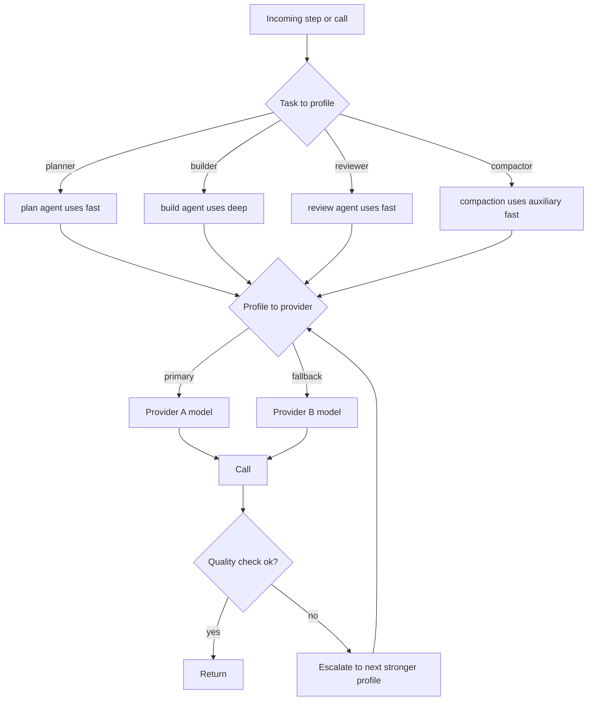
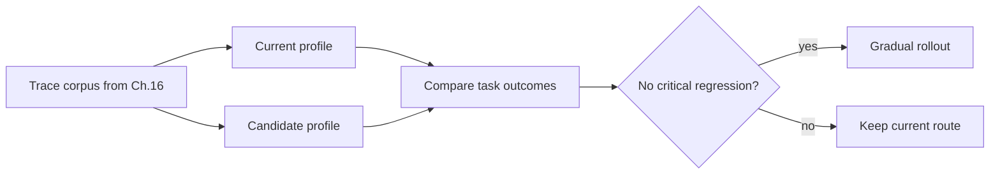

# Chapter 17 — Cost, latency, and model strategy

## TL;DR

Model choice is an architecture decision, not a constant at the top of a file. Production agents route work across model profiles (fast, balanced, deep, embedding), enforce per-tenant budgets, retry transient failures, and escalate only when quality demands it. The biggest cost lever, though, is not picking the right model — it is *not calling a model at all* when a deterministic tool, a regex, a BM25 index, or a classical ML library would answer faster, cheaper, and more reliably. This chapter covers the routing cascade, the auxiliary-model tier, the don't-call-the-LLM heuristic, pre-call token budgets, streaming-vs-batch trade-offs, prompt caching as a per-tenant amortization lever, eval-gated promotion, cost forecasting, anomaly response policy, and the operator override.

---

## Why this matters

An agent loop multiplies model calls. A single workflow may call a model for planning, tool selection, retrieval synthesis, the final response, an evaluation pass, and a memory curation step. If every call uses the most expensive model, the system becomes economically fragile. If every call uses the cheapest model, quality fails in subtle ways the user only notices in the wrong moments. And if the call could have been a regex, you paid an LLM to do work a 1980s text processor would have done for free in microseconds.

The skill is routing — and routing starts by asking *should we call a model at all?* before asking *which one?*

---

## The concept

### The three-way trade

Three forces pull in different directions on every model call:

- **Quality** — does the output meet the bar?
- **Latency** — does it return fast enough for the request shape?
- **Cost** — does the tenant's budget cover it?

There is no model that wins all three. Production routing is the discipline of picking the right point on this triangle per call, not picking one winner globally.

### Model profiles, not model names

Use named profiles in your code and configuration. Map them to concrete provider model IDs in one place. The course can say *"use the `fast` profile for compaction"* without breaking when the underlying model changes — and pricing snapshots stay in one file with a date stamp.

```ts
type ModelProfileName =
  | "fast"            // small, fast, cheap; routine classification and summarization
  | "balanced"        // the default workhorse
  | "deep"            // expensive, reasoning-capable; hard problems and final review
  | "embedding"       // retrieval indexes; not a chat model
  | "local-private";  // on-device or in-VPC; sensitive content

type ModelProfile = {
  name:                ModelProfileName;
  provider:            "anthropic" | "openai" | "bedrock" | "local" | string;
  modelId:             string;
  contextWindowTokens: number;
  maxOutputTokens:     number;
  pricingSnapshot?: {
    retrievedAt:                 string;       // date-stamped
    inputPerMillionTokens:       number;
    outputPerMillionTokens:      number;
    cacheReadPerMillionTokens?:  number;
    cacheWritePerMillionTokens?: number;
    sourceUrl:                   string;
  };
};
```

Five profiles cover almost every case. More profiles is more cognitive load for the team and more places to forget when a price changes.

### The routing cascade

Production systems route at three levels, in order:



- **Level 1 — Task to profile.** The agent or step type picks the profile. OpenCode binds the model to the *agent* (build, plan, explore, compaction). Paperclip binds adapter selection to the issue type; the adapter then has its own model. Hermes Agent picks at session start and stays fixed.
- **Level 2 — Profile to provider with fallback.** Each profile has a primary provider/model and a fallback chain. On 429, quota error, or 5xx, rotate keys (Hermes Agent's credential pool) or fall back to the next provider. This is the Ch.15 rate-limit cascade.
- **Level 3 — Quality escalation.** If a cheap call produces an output that fails an automated quality check, re-run with the next stronger profile. Treat this as separate from infrastructure retry — *quality escalation* and *transient retry* are different mechanisms.

### Per-call vs per-step vs per-run selection

A subtle but expensive trap: changing the model mid-session usually breaks Ch.04's prompt cache. Three policies, in roughly decreasing order of cost-friendliness:

- **Per-run** (most production systems). The model is chosen at session start and stays fixed for the run. Cache hits compound across turns.
- **Per-step** (rare in practice). Each step can pick a different model. Useful for the auxiliary tier (next section) where a separate cheap model handles compaction or summarization; but if the *main* model rotates per step, you pay the cache miss every time.
- **Per-call** (rare for the main agent; normal for routers and the auxiliary tier). Each individual call routes independently. Cross-call cache amortization is essentially gone, so this only makes sense when the architecture has explicitly traded cache for routing flexibility — LLM router services that classify and route per request, or the auxiliary tier where calls are short and cache compounding was not the point anyway.

The rule: **the main agent model is per-run; auxiliary models and router-shaped calls can be per-step or per-call.** Letting the main agent rotate per call is the most common cost-blowup in agent systems; the cure is usually being explicit about which calls are *router-shaped* (no cache assumption) and which are *session-shaped* (cache compounds).

### The auxiliary model tier

Production systems do not run all model calls through the main agent. They keep a separate *auxiliary* tier for narrow, cheap, tool-less tasks:

- **Compaction** (Ch.05) — Hermes Agent's `auxiliary_client` calls a cheaper model for `ContextCompressor`; OpenCode's dedicated `compaction` agent runs with no tools and a fixed budget.
- **Summarization** — turning long tool results into snippets; turning a 50-turn transcript into a handoff block.
- **Classification** — *"is this a question or a command?"* — a cheap call with a tight schema.
- **Title and slug generation** — OpenCode runs a `title` agent for the session label.
- **Embedding generation** — not a chat model at all; a different shape entirely.

The auxiliary tier is the second-biggest cost lever after caching. Running compaction on the same expensive model as the main agent can double a session's bill for work the cheap model handles fine.

### Don't call the LLM at all

The biggest cost lever is also the easiest to miss: when a deterministic tool, a library, or a regex can answer the question, the LLM should not be involved at all. Production systems are ruthlessly deterministic for any query with a ground-truth answer.

| Task | Deterministic option | When to add an LLM |
|---|---|---|
| Find files by name pattern | `glob`, `ripgrep` | Never |
| Find code by exact string | `ripgrep`, FTS5 | Never |
| Find semantically-similar text | Embeddings + ANN (`sqlite-vec`, `pgvector`) | Only for ambiguous queries needing rerank |
| Parse JSON, YAML, CSV | A parser library | Never |
| Extract structured fields | Regex, lookup tables, classical NER | Only when the input format is unbounded |
| Detect language / intent | Fast classifier (fastText, regex rules) | Only when ambiguous edges matter |
| Compute, count, aggregate | Code, SQL | Never — models are bad at arithmetic |
| Render a diff | `diff` library | Never |
| Validate a schema | Schema validator | Never |
| Format output (JSON, markdown) | A serializer | Only if the output schema is open-ended |
| Summarize known structure | Templates, slot-filling | Only for free-form text |
| Pick a category from a closed list | Classifier or rule engine | Only for ambiguous edges |

OpenCode's tool layer is the clearest reference: file search is `ripgrep` and `glob`, never the LLM. Hermes Agent's `session_search` uses FTS5 first and only invokes an LLM to summarize the results. Paperclip's heartbeat does *no* LLM calls itself — it routes work to adapters that may or may not.

The rule of thumb: *if the query has a deterministic answer, use a deterministic tool. LLM is for subjective judgment.* Every model call you skip is a saving on cost, latency, and the chance the model invents an answer.

```ts
// A router that prefers deterministic paths.
async function answer(query: Query, ctx: Context) {
  if (query.shape === "file_search")    return await ctx.tools.ripgrep(query);
  if (query.shape === "structured_get") return await ctx.db.get(query.key);
  if (query.shape === "parse_known")    return await ctx.parser.parse(query);
  if (query.shape === "classify_closed") {
    const result = ctx.classifier.predict(query.text);
    if (result.confidence > 0.9) return result.label;
    // fall through to LLM only on low confidence
  }
  return await ctx.llm.call(query, { profile: "balanced" });
}
```

### Token-estimate-before-send

Before any call to a model, count the tokens. Three things become possible:

- **Reject before the bill.** If the request would exceed the tenant's budget, return early with a clear error rather than discovering it after the provider has billed you.
- **Compact before overflow.** If the request would exceed the context window, run compaction first (Ch.05) — cheaper than catching the `prompt_too_long` error and retrying.
- **Pick the right profile.** If the request is 200 tokens, the `fast` profile fits; if it is 50 K tokens with deep reasoning needed, the `deep` profile is required regardless of budget.

Hermes Agent's `model_metadata.py` caches per-model context limits and cost multipliers exactly for this pre-call check. OpenCode's `usable()` computes `context_limit − max_output − safety_buffer` and triggers compaction before the next call. Both treat the token count as the canonical pre-call gate.

### Streaming vs non-streaming: a cost lever, not just UX

Streaming feels like a UX choice (live tokens to the user), but it also affects cost shape:

- **Streaming** — partial output starts arriving in milliseconds; the user can interrupt mid-response. Same per-token cost as non-streaming, but the *perceived* latency is much lower. The right default for interactive chat.
- **Non-streaming** — one round-trip, full response in one read. Lower HTTP overhead at scale (one connection vs many for the same payload). Allows post-processing the full response before showing the user. The right default for batch jobs, cron, scheduled work.

Hermes Agent makes this explicit with a `streaming=True/False` flag. Paperclip adapters choose per adapter. The rule: *interactive shape gets streaming; non-interactive shape does not need it.* Streaming is not free at scale — each open connection holds a worker thread (Ch.15).

### Prompt caching as multi-tenant amortization

Ch.04 covered the cache mechanics; the cost angle here is different. Cache savings can compound *across* sessions, not just within one — *when* a set of conditions hold:

- A system prompt built once and reused across many sessions amortizes its cache-creation cost across all of them, provided the prefix is byte-stable (Ch.04), the model is the same on every call (the per-run discipline above), the tenant or org scoping the provider applies is consistent, the provider's cache retention window has not elapsed between uses, and the cadence of requests is dense enough to keep the entries warm. Drop any of those preconditions and the amortization stops. Cached input tokens are typically billed at a fraction of fresh input on providers that expose explicit caching; the multiplier is vendor-specific and changes — read the current pricing page, never hardcode a ratio.
- Hermes Agent persists the rendered system prompt in `SessionDB` so a gateway eviction followed by a new user message replays byte-identical bytes — the cache survives the eviction *if* the retention window has not.
- OpenCode's two-part system array (model-family rules + agent-specific overrides) is shaped to let the model-family half cache-hit across many agents.

The implication for routing: keep the model the same within a session whenever possible, and keep the system prompt byte-stable across sessions (Ch.04's rule). Switching models mid-session, or rebuilding the prompt with a timestamp, throws away the multi-session amortization.

### Retry vs escalation

Production systems distinguish two failure classes; they are not the same mechanism:

```ts
async function routeAndCall(step: AgentStep, ctx: ModelContext) {
  const profile = chooseProfile(step);

  // Transient: infrastructure retry with backoff.
  const result = await callWithRetry({ ...step, profile }, ctx);

  // Quality escalation: a different mechanism.
  if (await passesQualityCheck(step, result)) return result;

  const stronger = nextStrongerProfile(profile);
  if (!stronger) return result;

  await ctx.trace.event("model.escalated", {
    from: profile, to: stronger, reason: "quality_check_failed",
  });
  return callWithRetry({ ...step, profile: stronger }, ctx);
}
```

- **Transient retry** handles 429, 5xx, network errors. Backoff, retry, ultimately fall back to a different provider (Ch.15's cascade). The model output is the same target.
- **Quality escalation** handles a successful call whose output failed a downstream check (schema validation, evaluator subagent, basic sanity). Re-run with a stronger profile. The model output is *better* the second time.

Treating quality failures as retries is a common bug: retrying the same cheap model with the same prompt produces the same insufficient answer.

### Cost forecasting per tenant

Reactive budget gates (Ch.15) refuse a run after it has started. Forecasting gates *before* the run, and routes accordingly:

- **Estimate per-run cost from session shape.** Recent runs of similar tasks for the same tenant give a baseline; multiply by the model's per-token cost.
- **Compare against remaining budget.** If forecast > remaining, the response depends on the tenant's *budget policy*, not a hardcoded default. Some tenants — a high-stakes legal-review workflow, a regulated-data deployment — prefer to *block* and ask for budget approval rather than silently get a cheaper answer. Others — interactive chat, exploratory coding — prefer to *downgrade*: route to a cheaper profile, enable more aggressive compaction, surface the trade-off in the UI. The router reads the policy; downgrade is *one* valid policy, not the default. Mixing a quality contract with a cost contract without an explicit policy choice is how a downgrade-on-overrun system silently violates a regulated-data agreement.
- **Surface the forecast to the user when it matters.** *"This task is estimated to cost $2.40 on your current settings; switch to the fast profile to estimate $0.30?"* — operator override (below) handles the choice.

Paperclip's `budget_policies` table holds the tenant tier; the forecasting layer reads it before dispatching. Hermes Agent does not forecast; it reacts after the fact. The forecasting pattern is the cheaper path to ship if you can afford to instrument it once.

### Cost anomaly response

Ch.16 introduced cost anomaly *detection* — the 3× rolling-7-day alert. Ch.17 owns the *response policy*:

- **Soft response.** Route the tenant to a cheaper profile for the next N runs; enable stricter compaction; notify the user that they are spending unusually.
- **Hard response.** Pause new runs for that tenant; require operator acknowledgment before resuming; mark any in-flight runs as `scheduled_retry` (Ch.08) so they pick up after the human review.
- **Tiered response.** First spike: soft. Persistent spike across two days: hard. Manual override: bypass both.

The pattern that works in production is *automated soft, manual hard*. Soft responses are reversible and cheap to be wrong about; hard responses block real work and need a human decision.

### Operator override

Routing must have an escape hatch. Two patterns:

- **Per-run model bump.** *"This task is mission-critical; run it on `deep` regardless of policy."* Recorded in the audit log (Ch.05); cost charged against an override budget the operator owns.
- **Per-session pinning.** Lock a specific session to a specific model for the duration of an investigation or debugging session.

Paperclip's `assigneeAdapterOverrides` JSONB on the issue is exactly this — an operator-set override that the heartbeat respects when dispatching. OpenCode lets the user pick an agent (and thus model) per session via a CLI flag or UI. Both are necessary; pure automatic routing without an override turns one bad decision into a long incident.

### Eval-gated promotion

Before moving a step from `balanced` to `fast` (a *demotion* for cost savings) or from `balanced` to `deep` (a *promotion* for quality), replay representative traces and compare outcomes:



This is Ch.16's eval-as-observability pattern applied to routing. The architecture is provider-independent: collect production traces (Ch.16), replay against the candidate profile, score outcomes with an evaluator subagent (Ch.10's verification pattern) or a deterministic comparison, gate the rollout. Run eval per-tenant where possible — a profile that works for one workload may regress on another.

### Latency budgets per request type

Different request shapes have different latency tolerances. Wire this in early so the router knows what to optimize for:

| Request shape | p50 budget | p95 budget | Compatible profiles |
|---|---|---|---|
| Interactive chat (TUI, web) | <2 s to first token | <10 s total | `fast`, `balanced` with streaming |
| Long-running coding task | <30 s per step | <2 min per step | `balanced`, `deep` |
| Background curation (Ch.07) | n/a | <5 min | `fast` auxiliary |
| Cron / scheduled work | n/a | minutes to hours | any profile |
| Eval batch | n/a | hours | any profile, often `fast` |

Match the profile to the budget. A `deep` profile on a chat request is a UX failure even if it gets the right answer. A `fast` profile on a hard coding task wastes the operator's afternoon on poor output.

### Cache-aware costing

Pricing math has to account for cached input tokens being cheaper than fresh ones:

```ts
// The cost formula expects a provider-normalized Usage shape.
// Each provider adapter (Ch.11) produces this; the cost layer never sees
// the raw provider response.
type NormalizedUsage = {
  freshInputTokens:       number;   // input billed at the full rate
  cacheReadInputTokens:   number;   // input billed at the cache-read rate
  cacheWriteInputTokens:  number;   // input billed at the cache-write rate, if any
  outputTokens:           number;
};

function estimateCost(profile: ModelProfile, usage: NormalizedUsage): number {
  const p = profile.pricingSnapshot;
  if (!p) return 0;
  return (usage.freshInputTokens      * p.inputPerMillionTokens        / 1e6)
       + (usage.cacheReadInputTokens  * (p.cacheReadPerMillionTokens  ?? p.inputPerMillionTokens) / 1e6)
       + (usage.cacheWriteInputTokens * (p.cacheWritePerMillionTokens ?? p.inputPerMillionTokens) / 1e6)
       + (usage.outputTokens          * p.outputPerMillionTokens       / 1e6);
}
```

Provider usage reports disagree on what `input_tokens` includes — some count cached tokens inside the input total, others report them separately, some have additional per-request line items (reasoning tokens, tool tokens). *Normalize at the adapter boundary*: each provider adapter from Ch.11 emits the `NormalizedUsage` shape; the cost formula never sees the raw provider response. Skip this and you double-count on one provider while under-counting on another — and every downstream cost decision inherits the error. The pricing snapshot's per-cache fields are deliberately stubs: cache multipliers and special-purpose token rates are vendor-specific and change frequently, so the snapshot's job is to *carry the current numbers with a date stamp and a source URL*, not to encode defaults that quietly age out.

### Provider economics beyond per-token

Per-token input/output pricing is the headline. Production routing has to account for several other lanes the vendors offer:

- **Batch / flex tiers.** Many providers offer a discounted lane for async work with looser latency — often a substantial fraction off the synchronous rate, in exchange for a delayed response window. Background curation (Ch.07), continuous eval batches (Ch.16), and overnight cron work are natural fits. Surface the lane as a per-workload toggle, not a global setting.
- **Priority tiers.** The opposite lane: a premium for guaranteed throughput or shorter latency under load. Useful for paid-tier traffic with SLAs; rarely worth paying for free-tier work.
- **Retry cost is real.** A 429 you retry is two billable calls if the first one already streamed tokens before failing, and the cost compounds if the retry lands on a more expensive fallback. Track retries as their own line in Ch.16's metric catalog so you can see the second-order cost of an unhealthy provider rather than burying it in the original call.
- **Per-provider quirks.** Some providers do not bill at all for cached input on certain endpoints; some charge a cache-creation premium that disappears after the first hit; some discount embeddings heavily relative to chat; some price differently per region. The cost router needs a per-provider notion of pricing shape, not a generic per-model rate.

Surface all of these as policy knobs on the routing layer, not as hardcoded constants. The vendor landscape moves quarterly; the router's job is to know which lanes exist and let the operator pick the one that matches the workload.

---

## Real-system notes

- **Paperclip** exposes model profiles through adapter manifests and uses `budget_policies` + `cost_events` tables at the control plane. The `modelProfileHint` on issues is the operator-override pattern; the heartbeat consults it before dispatch. Strongest reference for per-tenant cost forecasting and budget enforcement.
- **OpenCode** binds models to agents (build, plan, explore, compaction, title), each with its own permission set. The compaction agent is a clean example of an auxiliary model — no tools, cheap, dedicated to one job. Provider-family-specific system prompts (`SystemPrompt.provider(model)`) preserve cache stability per family.
- **Hermes Agent** maintains a model metadata cache (`model_metadata.py`) with context limits and cost multipliers, calls `auxiliary_client` for compaction with a cheaper model than the main agent, and rotates API keys via `credential_pool` on 429. The clearest reference for the don't-blow-the-budget-by-checking-tokens-first pattern.
- **OpenClaw** is the reminder that routing is not only price: channel, privacy, and backend availability also matter for a personal-assistant gateway. A local model is the right choice for sensitive content even when the cloud model is cheaper.

---

## Pair with your agent

- *"Inventory every model call in my agent. For each, tell me which profile it should use (`fast`, `balanced`, `deep`, `embedding`, `local-private`) and why. Flag any call that is currently using the wrong profile."*
- *"Walk through my tool registry. For each tool, decide whether it could be replaced or shortcut by a deterministic library (`ripgrep`, FTS5, embeddings, regex, schema validator). Show me the savings estimate for the highest-traffic ones."*
- *"Add the auxiliary model tier: a separate cheaper model for compaction (Ch.05), summarization, and classification. Verify the main agent's model stays the same per run so the prompt cache from Ch.04 keeps hitting."*
- *"Implement pre-call token budgeting: count tokens before the call, compact if over the context limit, refuse if over the tenant's remaining budget, return a clean error to the user. Test with three deliberately oversized prompts."*
- *"Build the routing cascade from this chapter as code: Level 1 task → profile, Level 2 profile → provider with fallback chain, Level 3 quality escalation on failed check. Wire it into my loop and log every escalation event."*
- *"Set up cost forecasting per tenant. Use my last month of `cost_events` to estimate per-run cost by task type. When a forecast exceeds remaining budget, route to a cheaper profile instead of blocking. Show me three real runs and the routing decision for each."*
- *"Add an operator override: an `assigneeAdapterOverrides`-style field on each run that can bump the model for that run only. Log the override in the audit log (Ch.05); charge against a separate override budget."*
- *"Stand up an eval-gated promotion loop: every week, sample 50 production runs, replay against the next cheaper profile, score with an evaluator subagent (Ch.10), promote only if no critical regression. Run it for one specific step type to start."*
- *"Plot my cost per turn split across fresh input, cache_read input, cache_write input, and output for the last week. Tell me whether my prompt cache is earning its keep and where I should tighten the prefix to widen the gap."*

---

## What's next

You now have a routing layer that picks the right model for each call, knows when not to call a model at all, recovers from provider failures, and enforces budgets without surprise charges. The next chapter shifts from cost control to harm prevention: Ch.18 covers safety and adversarial inputs — prompt injection, the threat model at the memory boundary, tool scoping, and the policy controls that keep an agent from being weaponized against its user.
