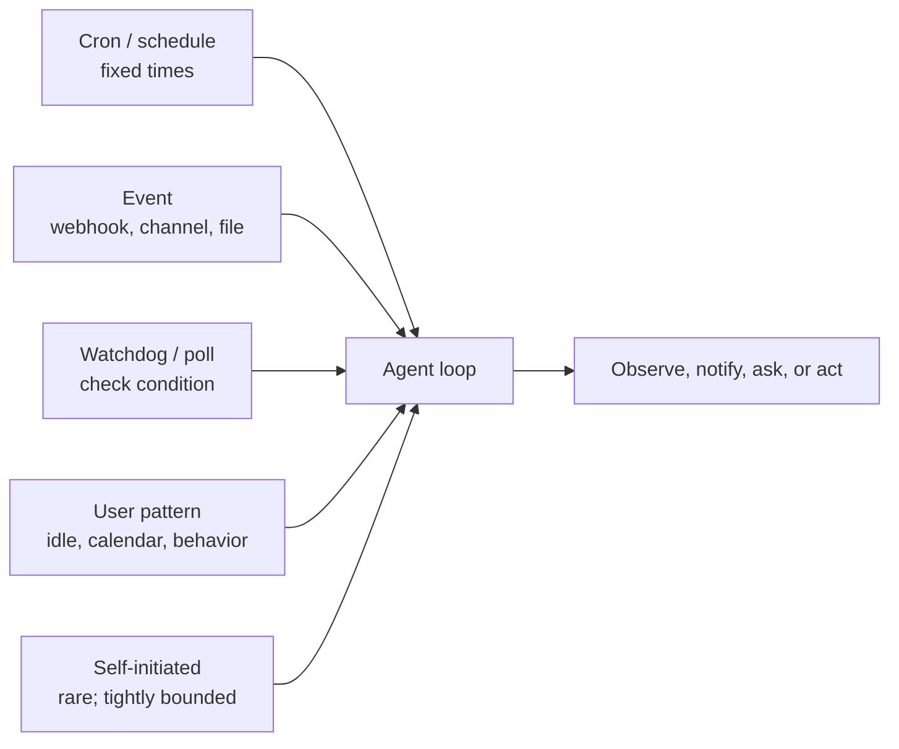
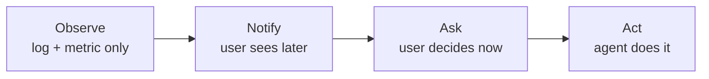

# Chapter 20 — Proactive agents

## TL;DR

Most of this course assumes a reactive shape: user message arrives, agent loop runs, response goes back. Proactive agents do work *when no user asked* — scheduled cron jobs, event-driven wakeups, watchdogs reacting to external state changes, background curation, and the rare self-initiated task. The mechanics are mostly familiar from earlier chapters (Ch.08's run state machine, Ch.13's channel adapters, Ch.15's heartbeat scheduler), but the design discipline is genuinely new: when to interrupt vs queue vs digest, how to design opt-in semantics so proactivity helps rather than annoys, the escalation ladder from notify to ask to act, the failure modes specific to work done when no one is watching, and the rule that proactivity is a permission the user grants *per category* — never a default.

---

## Why this matters

A reactive agent's worst failure is a wrong answer. A proactive agent's worst failure is one of three things: a *wrong action* no one was there to stop, a *cost spiral* no one was watching, or a *notification flood* that trains the user to ignore everything from the agent. Each is a category of incident that does not show up in synchronous request-response systems; each is the predictable failure mode if you ship proactive features without the disciplines in this chapter.

The other reason it matters: proactive features are the difference between a tool the user opens when they remember and an agent that becomes part of how the user works. A daily 9 a.m. briefing, a watchdog that flags when a deploy fails, a cron job that summarizes the week's PRs — these are the moments an agent earns its place. Done well, they compound the user's trust. Done badly, they squander it in a week.

---

## The concept

### Reactive vs proactive — when each fits

Most agents start reactive and stay reactive. Add proactive shapes only when one of these is true:

- The user has a **recurring need** that does not require their attention each time — daily reports, weekly summaries, periodic health checks.
- Something in the world **changes** and the user needs to know within minutes, not hours — a deploy failed, a metric crossed a threshold, an email arrived from a watched sender.
- The work itself is best done when the user is *not* around — background curation, eval runs, idle-window training (Ch.21 picks this up).

If none of these is true, do not add a proactive shape. *Proactivity is a feature; idle running is a cost.*

### The trigger taxonomy

Five trigger types account for almost all production proactive work:



- **Cron / schedule.** Fixed times — every weekday at 9 a.m., every hour on the hour. The simplest and most predictable; works for routine recurring tasks.
- **Event-driven.** A webhook fires (Ch.13), a channel message arrives, a file changes, a calendar event triggers. The most responsive; feels intelligent because it reacts to the world rather than the clock.
- **Watchdog / polling.** Agent periodically checks a condition (a price, a queue depth, a status page) and acts only when it is met. Useful when the source system does not emit events.
- **User-pattern triggered.** Agent notices a behavior pattern — user is idle, has a calendar gap, has not responded in N hours — and offers help. Hardest to get right; easiest to make annoying.
- **Self-initiated.** Rare. The agent decides on its own that something is worth doing without a trigger. Reserve for tightly-bounded, low-stakes actions (the background curator from Ch.07 is one).

Most real systems combine two or more. *Cron + event* is the most common pair: a cron job that checks something, plus event handlers that fire when something specific happens.

### Cron — the workhorse

Three things separate working cron from broken cron:

- **Persisted job definitions.** Hermes Agent stores cron jobs in `~/.hermes/cron/jobs.json`, a file the scheduler reads on each tick. Paperclip stores routines in a Postgres `routines` table that survives restarts. OpenClaw keeps them in config. The store must survive a process restart — anything else loses scheduled work when you redeploy.
- **Missed-fire policy.** What happens when a job's scheduled time passed while the process was down? Three options — *fire once on recovery* (run it now), *skip* (treat as if it ran), *fire each missed instance* (catch up by running once per missed window). Pick one explicitly; the default in many cron libraries is implementation-defined and confusing.
- **Idempotency.** A cron job that re-fires after a crash mid-execution should not do its work twice. Use a run key derived from the cron expression plus the scheduled time; deduplicate against it before executing. Ch.08's outbox pattern applies here unchanged.

```ts
// Cron job shape that survives restarts and avoids double-fire.
type CronJob = {
  id:           string;
  agent:        string;          // which agent profile runs the job
  schedule:     string;          // cron expression
  missedFire:   "skip" | "once_on_recovery" | "fire_each";
  payload:      unknown;         // what the agent should do
  enabled:      boolean;
  createdAt:    string;          // anchor for the first scheduled window
  lastFiredAt?: string;
  ownerUserId:  string;          // for tenant scoping and audit (Ch.05, Ch.15)
};

function runKey(job: CronJob, scheduledFor: Date): string {
  return sha256(`${job.id}:${scheduledFor.toISOString()}`).slice(0, 32);
}

async function maybeFireCron(job: CronJob, now: Date, ctx: SchedulerCtx) {
  // Anchor next from the last fired window or — for a never-fired job —
  // from createdAt. Computing from `now` here would silently skip every
  // window that should have fired between creation and now, which is
  // wrong for any missed-fire policy except "skip".
  const anchor = job.lastFiredAt ?? job.createdAt;
  const next   = nextScheduledTime(job.schedule, anchor);
  if (next > now) return;

  const key = runKey(job, next);

  // Atomic claim: the dedup record, the queue insert, and the lastFiredAt
  // update commit in one transaction. Without atomicity, a crash between
  // enqueue and record re-fires the job on recovery — double execution
  // of a side effect that may not be safe to repeat (Ch.08's outbox
  // pattern is the same shape, generalised).
  await ctx.db.transaction(async (tx) => {
    const claimed = await tx.dedup.tryClaim(key);   // false if key already seen
    if (!claimed) return;
    await tx.runs.enqueue({ agent: job.agent, payload: job.payload, runKey: key });
    await tx.cron.markFired(job.id, next);
  });
}
```

The anchor interacts with the missed-fire policy: `fire_each` walks forward from `createdAt` and claims a key per missed window; `once_on_recovery` claims exactly one regardless of how many windows passed; `skip` advances `lastFiredAt` to the most recent past window without firing. Per-tenant isolation matters here too: a cron job for tenant A runs against tenant A's data, billed to tenant A's budget (Ch.15), audited to tenant A's log (Ch.05). One tenant's runaway cron should never block another's.

### Event-driven wakeups

Event triggers ride on the connector layer from Ch.13. Three shapes:

- **Webhook triggers.** A platform fires an HTTP callback when an event happens — a Slack message, a Stripe event, a GitHub push. The webhook handler from Ch.13 (HMAC + dedup + 202-then-queue) hands the event to the agent loop. The agent treats it as a `ChannelEvent` — same shape as a user message, different semantic.
- **Channel-event subscriptions.** Discord WebSocket, Slack events API, IMAP push notifications. The channel adapter holds an open connection and queues events as they arrive.
- **File-system or storage watchers.** `inotify`, S3 bucket notifications, cloud storage triggers. The watcher fires when a file is created or modified; the agent inspects and decides whether to act.

The discipline that holds across all three: events go through the same queue as user messages (Ch.15), so the agent's loop, observability, and budget enforcement work uniformly. *An event is just a message the user did not type.*

### Watchdog and polling

When the source system does not emit events, the agent polls. Three rules:

- **Match the cadence to the volatility.** A price-watcher that polls every second is wasteful; a deploy-status poller that polls every hour is too slow. Pick a cadence that matches the source's rate of change and the consumer's latency budget.
- **Back off on stable.** When the watched value has not changed for a while, increase the poll interval. When it changes, drop back to the baseline. Saves the source system from unnecessary load.
- **Surface the watch itself as a metric.** Ch.16's observability pattern applies — the poller emits a span per check, a counter for *value changed*, a histogram for poll latency. A silent poller is a poller you cannot trust.

Paperclip's `scanSilentActiveRuns` (Ch.15) is a watchdog applied to the agent *itself* — checking for runs with no output over a threshold and escalating. The same pattern applied externally: agent watches a system, escalates when something drifts.

### Opt-in semantics — proactivity is a permission

The single most important rule: *proactivity is a permission the user grants per category, not a default.* The user should not have to mute their agent; they should have to opt into being interrupted.

```ts
// A coarse-grained permission record. Per category, not per message.
type ProactivePermission = {
  category:       string;        // "daily_brief", "deploy_alerts", "weekly_summary"
  enabled:        boolean;
  channel:        "inline" | "email" | "slack" | "push";
  frequencyCap?:  { count: number; per: "hour" | "day" | "week" };
  quietHours?:    { start: string; end: string; timezone: string };
  snoozeUntil?:   string;
};

// Before sending a proactive notification, check all gates.
async function shouldNotify(
  user: User,
  category: string,
  now: Date,
  ctx: ProactiveCtx,
): Promise<boolean> {
  const perm = await ctx.permissions.get(user.id, category);
  if (!perm?.enabled)                                           return false;
  if (perm.snoozeUntil && now < new Date(perm.snoozeUntil))    return false;
  if (perm.quietHours && isInQuietHours(now, perm.quietHours)) return false;
  if (perm.frequencyCap) {
    const sent = await ctx.notifyLog.countRecent(
      user.id, category, perm.frequencyCap.per,
    );
    if (sent >= perm.frequencyCap.count) return false;
  }
  return true;
}
```

Categories are coarse, not per-message — the user opts into *deploy alerts* once, not into every deploy. Channel is per-category — inline for urgent, email for digest. Frequency caps and quiet hours prevent the agent from violating implicit expectations even within an enabled category.

The honest framing: every proactive feature ships *disabled by default,* and the agent's first job for that feature is to ask the user whether they want it. *Surprise is the enemy of trust.*

### Timing intelligence — interrupt, queue, or digest

For every proactive event, three timing choices:

| Mode | When to use | Cost | Example |
|---|---|---|---|
| **Interrupt now** | High-urgency, time-bounded value | User attention | Production deploy failed |
| **Queue for next session** | Useful soon but not urgent | Small cognitive backlog | New PRs to review Monday |
| **Digest** | Useful in aggregate, low value individually | None per item | Daily email summary |

The default for most proactive features should be *digest.* Interrupt only for things the user has explicitly told you are interrupt-worthy. Even within a session, batch related notifications — five PR comments delivered together are less disruptive than five separate pings.

MetaClaw's idle-window scheduler (Ch.21's self-evolution chapter goes deeper) is timing intelligence applied to training: heavy work runs during sleep hours, keyboard idle, calendar gaps. The same principle applies to any proactive work — *do it when the user is not paying attention to anything else.*

### The escalation ladder

For any class of proactive action, the agent has four rungs to choose from:



- **Observe.** Just record the event. No user-facing surface. Useful for building the data set that informs later rungs.
- **Notify.** Surface in a digest or low-priority channel. The user sees it; nothing acts on their behalf.
- **Ask.** Surface as an active prompt. The user decides whether to act; the agent's job is to make the decision easy.
- **Act.** Agent takes the action directly. Only valid when the user has previously opted into autonomous action for this category, the action is reversible, and the audit log records it (Ch.05).

A useful rule: *start at observe, earn the right to climb.* A new proactive feature ships at observe-only until you have data that the user wants the next rung. Then notify. Then ask. Then — only with explicit opt-in and rollback discipline — act.

### Notification design and the flood problem

The most predictable failure of proactive agents is the notification flood. Three defenses:

- **Frequency caps per category.** Five Slack pings an hour is annoying; one is welcome. Cap and queue the rest into a digest.
- **Adaptive cadence.** When the user ignores N notifications in a row, slow down. Ask explicitly whether to keep this category enabled.
- **Snooze and mute as first-class actions.** Every notification carries a *quiet this until later* control. The user choosing to snooze is information — log it and let it influence the cadence.

The pattern across mature notification systems (Slack, GitHub, Linear): notifications get less attention each time the user does not engage. A proactive agent that learns from non-engagement is one the user keeps; one that does not is one they mute and forget.

### Permission and approval for unattended work

Ch.12's approval gate assumes a user is there to click. Proactive work breaks that assumption. Three policies:

- **Pre-approved categories.** Anything the user has explicitly enabled (the opt-in above) needs no further approval per execution — *provided* the action is bounded, non-destructive, and reversible. A category-level *yes* never bypasses the Ch.12 approval gate for destructive actions (delete, send, charge, deploy); those remain per-instance even within a pre-approved category. See *What NOT to make proactive* below for the residual list that always escalates.
- **Async approval.** The agent proposes the action, surfaces it through a channel that allows a deferred response (Slack, email, mobile push), waits for approval before acting. Bounded — if no response in N hours, default to *do not act* and log the timeout.
- **Default-deny.** Anything not in a pre-approved category and not asked-and-answered does not run. Period.

The trap to avoid is *implicit consent* — *"the user has been ignoring my proactive emails for a week, that means it's fine."* It does not. Lack of objection is not approval. If a category is not earning its keep, surface that to the user and ask whether to disable it.

### The "no user is watching" failure modes

Three failure classes specific to proactive work:

- **Silent errors.** A cron job has been failing for two weeks; nobody noticed because nobody runs it manually. Defense: every proactive run emits a span (Ch.16) and an alert on consecutive failures.
- **Cost spirals.** A watchdog polls every 30 seconds for a year; nobody sees the bill until it arrives. Defense: per-tenant budget gates (Ch.15) apply to proactive runs *the same as interactive ones.* Surface the trend in the cost dashboard (Ch.16).
- **Runaway loops.** A self-initiated agent spawns subagents that spawn subagents. Ch.10's recursion cap and Ch.02's step cap apply, but for proactive work the limits should be *tighter* than interactive — the user is not there to interrupt.

A useful production touch: every proactive run carries a tag (`triggered_by: cron | event | watchdog | pattern | self`) on its trace. Dashboards split by trigger type. When something goes wrong, you know whether the user kicked it off or the system did.

### What NOT to make proactive

The reverse list, by category of risk:

- **Destructive actions.** Anything that deletes, sends, charges, deploys. Always require an explicit user decision per instance, even within a pre-approved category.
- **Cross-tenant operations.** A proactive run for tenant A should never touch tenant B's data. Ch.06's namespace rule is non-negotiable.
- **Irreversible side effects.** If you cannot roll it back, do not let the agent do it on its own.
- **Anything the user has not seen first.** If a category has never been demoed to the user with their explicit *yes, please run this on its own*, it should not run on its own.

A useful rule: *if the action would make a reasonable user say "wait, what?" when they see the result, it should not have run proactively.*

---

## Real-system notes

- **Hermes Agent** is the strongest reference for file-backed cron and background-curator patterns: `~/.hermes/cron/jobs.json` with a file-locked tick scheduler, `spawn_background_review_thread` for post-turn proactive curation, and `maybe_run_curator` for idle-time skill lifecycle management. Cron jobs are scanned for prompt-injection patterns before execution — proactive runs get a tighter safety gate than interactive ones (Ch.18).
- **Paperclip** is the reference for orchestration-level proactive scheduling: heartbeat scheduler ticks every 30 seconds, `routineService.tickScheduledTriggers` fires due cron-based routines, `scanSilentActiveRuns` watchdogs detect stuck agents, retry delays escalate from 2 minutes to 2 hours. Per-company budget gates apply to all runs regardless of trigger type.
- **OpenClaw** is the reference for channel-event-driven proactive work: channel plugins hold their own subscriptions (Discord WebSocket, Slack events, Telegram polling), events go through the same gateway as user messages. Cron jobs run with full tool access by default — useful as a contrast for what *not* to do when proactive runs need a tighter trust boundary.
- **OpenCode** is mostly reactive (user-initiated coding sessions), but its session-event SSE stream and snapshot system are useful study for how to surface proactive activity to a connected UI.

---

## What's next

You now have a frame for proactive design — the trigger taxonomy, the opt-in discipline, the escalation ladder, the timing modes, and the failure modes specific to work done while no user is watching. Ch.21 picks up from a related angle: instead of *the agent acting on its own*, what if *the agent improves itself on its own?* Self-evolving agents — memory consolidation, skill learning, prompt refinement, LoRA personalization — are the natural complement to proactive scheduling, with the same gating discipline and the same need for the rollback paths from Ch.07.
