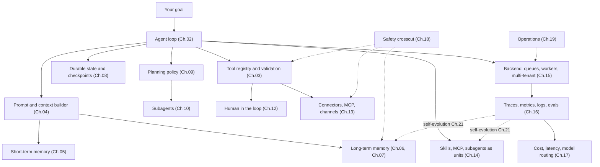

# Chapter 22 — Designing your own agent

You have read twenty-one chapters. This one is not another. It is a design canvas — a way to translate everything from Ch.01 through Ch.21 into the specific shape of *your* project. Lead with intent, not architecture: use case, goal, scope, budget, users, success criteria, worst-case mistake. Once intent is crisp, the architecture is mostly a matter of picking which earlier-chapter components are load-bearing and which can wait.

Tutorial projects usually have everyone build the same thing. That is useful for grading; it is not useful for taste, ownership, or shipping something you actually care about. Agent systems are broad — personal assistants, coding agents, research agents, workflow control planes, internal tools, enterprise automation, things that do not have a category yet. The course gave you the building blocks; this chapter helps you decide which of them your project actually needs.

The other thing this chapter does deliberately: it stops writing code. Every prior chapter has been a map; this one is a compass. The smallest credible first version has a clear job, a few tools, basic observability, and one stop condition. The code will come from your conversations with your agent, against your problem.

---

## The concept

### The whole system in one frame

Read it as a checklist of *what could be load-bearing*, not a blueprint of *what must be present*. Your first build will use maybe four of these boxes — the loop, a couple of tools, basic memory, a trace sink. Most of the rest are layers you add when the workload justifies them. Ch.11 is the composition layer that ties all of this together; Ch.19 is how it runs over time; Ch.20 covers the agent acting on its own initiative; Ch.21 closes the feedback edge from observability back into the memory and skills the agent uses on its next session.

If you can name every box and explain to a friend what it does, you are ready to build.

### Intent first — the project canvas

Before any architecture decision, answer these. None of the questions in this canvas is about *how*; all of them are about *what* and *why.*

- **Use case.** In one sentence, what concrete repeated task does the agent perform? *"It triages incoming support tickets and drafts replies for human review"* is a use case. *"It is an AI assistant"* is not.
- **Goal.** What does success look like for the user? Saved hours? Faster turnaround? Fewer errors? Be specific.
- **Scope.** What is in and out of scope for the first version? Be ruthless. Anything outside is the *next* version.
- **Budget.** How much can each run cost? How much per user per month? If you cannot answer this, the agent will tell you the answer in a bill you did not expect.
- **Users.** How many? Who are they? What is the support model? One operator with five colleagues is a different system from ten thousand strangers.
- **Success criteria.** How will you know it is working? What is the metric? Who measures it?
- **Worst-case mistake.** What is the worst plausible thing the agent could do? *"Send a wrong email"* is recoverable; *"Delete a customer's data"* is not. The answer here determines your Ch.12 approvals and Ch.18 controls.

Seven questions, ten minutes of writing. If any are vague, the architecture decisions that follow will be vague too. If they are all crisp, the architecture mostly composes itself.

### The architecture canvas — walk through this with your agent

Once intent is locked, sit down with your agent and walk through these together. Each item points at the chapter that has the full treatment; the agent can read those alongside you. The goal is not to answer every question now — it is to know which questions you have answered and which you have deferred.

- **Loop shape (Ch.02, Ch.09).** Is the task one-shot, multi-step, or long-running? Does it need an explicit plan, or is tool selection enough? What stop condition proves the run is finished?
- **Tools and permissions (Ch.03, Ch.12).** What tools does the agent need? Which are read-only, destructive, idempotent? Which need an approval gate?
- **Memory layers (Ch.05, Ch.06, Ch.07).** Does it need to remember user preferences, project facts, prior failures? File-backed, structured, vector, hybrid? Who can inspect, edit, or delete memory?
- **Persistence (Ch.08).** Does the run need to survive a crash or a deploy? What is the resume story?
- **Connectors (Ch.13).** Which channels — Slack, Telegram, web, CLI, MCP server, custom? Which adapters do you need to write?
- **Extension shape (Ch.14).** What does the agent learn that should become a skill (markdown), an MCP tool (external), or a subagent (its own loop)?
- **Backend topology (Ch.15).** Embedded single-process, gateway, or multi-machine? What does scale look like at 10× usage?
- **Observability (Ch.16).** What metrics matter? What does a successful trace look like? What is the minimum eval kit you will ship?
- **Cost strategy (Ch.17).** Where can you substitute a deterministic tool for an LLM call? What are the model profiles? What are the budget gates?
- **Safety (Ch.18).** Which trust tier owns each input source? Which attacks matter for your use case? What is the defense in depth?
- **Operations (Ch.19).** Who is the operator? Forward-deployed or hosted? What runbooks exist on day one?
- **Proactive triggers (Ch.20).** Does the agent do work without a user request — cron, webhooks, watchdogs? Which categories are opt-in? What is the escalation ladder?
- **Self-evolution (Ch.21).** What is allowed to evolve automatically? What stays under human change? What is the rollback path?

You do not need answers to all of these. You need to know which ones you have decided, which you have deferred, and which you have not even thought about. The agent reading this with you can walk you through any of them in depth on demand.

### Choose an archetype

Five archetypes recur across production agent systems. Pick the one closest to your project; the chapters that are load-bearing for that archetype are listed alongside.

- **Personal assistant gateway** — many inbound channels feeding one self-hosted agent. References: OpenClaw, Hermes Agent. Load-bearing: connectors (Ch.13), memory (Ch.05–07), safety (Ch.18), observability (Ch.16), forward-deployed operations (Ch.19), proactive triggers (Ch.20), self-evolution (Ch.21).
- **Coding agent** — reads, edits, tests, reasons over code. References: OpenCode. Load-bearing: tool validation (Ch.03), loop and stop conditions (Ch.02), state and resume (Ch.08), permissions and approvals (Ch.12), observability (Ch.16), cost strategy (Ch.17).
- **Workflow control plane** — coordinates many agents, tasks, approvals, budgets, workspaces. Reference: Paperclip. Load-bearing: backend infrastructure (Ch.15), HITL and governance (Ch.12), connectors (Ch.13), observability (Ch.16), durable state (Ch.08), multi-tenant safety (Ch.18).
- **Knowledge and research agent** — retrieval, synthesis, citation, keeping a knowledge base fresh. References: Hermes Agent's memory patterns, OpenCode's compaction. Load-bearing: long-term recall (Ch.06), context and cache (Ch.04, Ch.05), tool validation (Ch.03), observability with explicit eval (Ch.16), self-evolution for the knowledge base (Ch.21).
- **Forward-deployed enterprise agent** — bespoke, local-first, the engineer ships with the system. References: Hermes Agent, OpenClaw, parts of OpenCode. Load-bearing: operations (Ch.19), safety with strict trust boundaries (Ch.18), memory privacy (Ch.06, Ch.07), the runbook discipline (Ch.19), proactive triggers for unattended work (Ch.20), the self-evolution gates (Ch.21).

These are lenses, not required builds. Most real projects blend two — a coding agent with workflow-control-plane orchestration, a personal-assistant gateway with knowledge-base retrieval. Pick the closer of two and let the second one come in as you outgrow the first.

---

## Final thought

The point of the course was never to make you reproduce someone else's product or memorize a framework. It was to give you a system map. Once you can name the loop, the boundary, the prompt, the memory, the persistence, the planner, the delegation, the harness, the approval gate, the connector, the skill, the backend, the trace, the routing, the safety policy, the runbook, and the evolution feedback edge, you can design your own thing with much better instincts — and your agent can fill in the rest.

Go build something you actually want to exist. The agent reading this with you is ready when you are.
